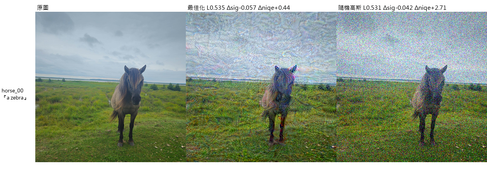

# 為什麼主題會發散，以及怎麼收斂

<!-- STATUS-BLOCK -->
| | |
|---|---|
| **狀態** | 提案。2026-08-04 撰寫，回應使用者「主題常常發散、操作的變因過多」 |
| **性質** | **建議，不是決定。** 研究方向由使用者決定；本檔的工作是把選項與證據攤開 |
| **依據** | 全部來自 `docs/LEDGER.md` 已入帳的條目，括號中的編號可回查 |

---

## 1. 發散不是隨機的，它有固定的形狀

先把「發散」這件事本身量出來，再談怎麼處理。

把三個月來約 30 個實驗按**它實際在回答什麼**分類。**這是判斷不是量測**
（同一個實驗常同時做兩件事），但比例的量級足以支撐後面的論證：

| 類 | 實驗 | 佔比 |
|---|---|---|
| 校準量測裝置（指標、約束、判準、有效約束診斷） | E13、E14、E20–E23、E27、E28、p1–p4、p9–p14、p16、L3 | **約 55%** |
| 除錯（發現設定或實作是錯的） | e2_phi0、E26、E29、六個假有效約束、今晚的三個 | 約 20% |
| 本專案的方法本身 | E15、E8、e29c、L4 | 約 15% |
| 基準與對齊 | L1、L2 | 約 10% |

**只有 15% 的力氣花在研究問題上。** 而且那 15% 的每一次，事後都被判定為
無效或不可用：E15 被 E20 撤回（匹配失真不成立）、E8 屬於 w = 1 批次、
e29c 是單張單種子、L4 的非加性側零格可用。

發散的形狀因此是一個**遞迴**，不是無方向的擴散：

```
① 在研究問題上跑一個實驗
② 得到一個數字
③ 事後診斷發現那個數字是別的東西造成的
④ 為了排除那個東西，開一個校準實驗
⑤ 回到 ①
```

這個迴圈至今跑了**九次**，每一次都有名字：

| # | 那一格實際被什麼決定 | 帳號 |
|---|---|---|
| 1 | L∞ hinge 把 site S 完全節流 | E13、6.2 |
| 2 | 步數（固定步數的網格） | E21–E23 §5.4、6.1 |
| 3 | `max_dev` 硬上界 | E27 §2、6.2 |
| 4 | 防禦 margin | E27 §2、5.6 |
| 5 | 原始 `lpips` 項（`alpha_lpips`） | E27、6.12 |
| 6 | 一個 lr 套用到全部 site | **2026-08-04**、6.16 |
| 7 | τ_acut／τ_chroma 沒有隨預算調整 | **2026-08-04**、6.17 |
| 8 | **目標函數在起點的梯度精確為零** | **2026-08-04**、5.10 |
| 9 | **停止門檻沿用了另一個監看量的值**（動態範圍差 39 倍） | **2026-08-04**、6.21 |

---

## 2. 為什麼會遞迴：同時活著的機制太多

每一格實驗同時有七個子系統在作用，任何一個錯了都會讓那一格量到別的東西：

| 子系統 | 選項數 | 這一格會不會被它決定 |
|---|---|---|
| 注入位置 | 7 個 site，各有自己的 φ 量綱與校準 lr | 會（#6） |
| 目標函數 | 4 類，各有不同的起點梯度幾何 | 會（#8） |
| 保真約束 | 3 道 hinge，門檻與預算耦合 | 會（#1、#7） |
| 停止準則 | 取決於有沒有 hinge 啟動過，且門檻與監看量綁在一起 | 會（#2、#9） |
| 淨化 EOT | 附帶目標，同時是主目標函數的啟動器（5.11） | 會（#8） |
| 攻擊方設定 | strength、guidance、n_edit | 會（E26） |
| 評測協定 | 種子數、參照、判準類別 | 會（1.4、1.15） |

**問題不在「掃了太多值」，在「同時可能出錯的東西太多」。**
七個子系統全部同時正確的機率，才是一直在失敗的那個量。

所以收斂的作法不是「少掃幾個值」，是**讓能出錯的東西變少**。

### 九次的形狀完全一樣，所以修法可以是結構性的

把九次逐一看過去，它們是同一句話：

> **一個為某個對象校準的值，被沿用到另一個對象上，而且沒有症狀。**

| # | 值 | 為誰校準 | 被沿用到 |
|---|---|---|---|
| 1 | `beta_linf = 100.0` | 加性位置 | 非加性位置 |
| 2 | `alpha_lpips = 1.0` | E2–E27 的可重現性 | 匹配失真的比較 |
| 3 | `plateau_stop` 只檢查「啟動過」 | E21–E31 的可重現性 | 匹配失真的比較 |
| 4 | `lr = 0.03` | site P（低秩） | site PF（全秩） |
| 5 | 一個 lr | site P/PF | **全部 site**（site S 差 12.5 倍） |
| 6 | τ_acut／τ_chroma | τ_lpips = 0.05 | τ_lpips = 0.10 |
| 7 | L∞ hinge 的門檻 | 加性 | site S |
| 8 | `max_dev`／防禦 margin | 各自的校準點 | 別的網格 |
| 9 | `stop_tol = 1e-4` | `edit_shift`（範圍 0.37） | `attn_div`（範圍 0.0095） |

**共通的成因是同一件事：那個值「為誰校準」這件資訊只寫在註解裡，
程式讀不到。** 於是換一個對象時沒有任何東西會擋。

**共通的修法也是同一件事**：把「為誰校準」寫成程式讀得到的表，
**未校準的對象直接拋出，不沿用、不內插、不退回預設值**。

    SITE_LR = {"P": 0.008, "PF": 0.008, "S": 0.1, "C": 0.3}     # 修 #4、#5
    runs/p14_budget_thresholds/thresholds.csv（由程式讀）        # 修 #6
    MONITOR_TOL = {"edit_shift": 1e-4, "attn_div": 1e-5}        # 修 #9

這比逐一補九個洞有用：**第十次會在執行的第一秒就報錯，而不是在事後
診斷時才發現。** 三個都已落實並有測試釘住。

---

## 3. 三個收斂動作

### 動作一：把「尺」和「被量的東西」分成兩件事

本專案真正原創的產出是**尺**：

| 產出 | 文獻上有沒有人做過 |
|---|---|
| 等 LPIPS 多條件探針（判別一個指標實際在收什麼費） | 沒有 |
| `local_acutance_dev`、`local_chroma_bias` | 沒有 |
| 逐預算門檻，以及 acut 軸的分離度隨預算塌掉（2.13） | 沒有 |
| 「匹配失真」三次被證明是假的完整紀錄 | 沒有 |
| 有效約束診斷（九個案例） | 沒有 |
| **判準三類在基準論文自己的協定上的不一致（1.15–1.17）** | 沒有 |

而研究問題（非加性勝過加性）目前是 0%，且有三件事同時指向預期效果量很小：

1. **L3**：文獻最強的基準在 5.4 倍於本專案的失真預算上，語意失敗也只有
   7/72 格（1.15）。
2. **同失真的隨機對照**：隨機高斯雜訊在 LPIPS 0.14 上就取得最佳化解 60% 的
   語意失效（1.18）。方法要贏的不是零，是這條免費基線。
3. **文獻上沒有前作**。2026-08-04 逐篇核對後（SURVEY §9.1），本專案原本引為
   非加性支持的兩篇都不成立：`arXiv:2512.08329` 是誤引（其 `non-additive`
   指的是堆疊保護時的偵測行為），STP-Diff 防的是人臉辨識、黑盒、判準是 PSR。
   **「非加性用於抗文字編輯」查不到任何直接前作**——新穎性高，但也沒有
   任何外部結果顯示這條路走得通。

於是這裡有**兩篇論文**，而一直想寫成一篇的結果是兩篇都沒有：

| | 要什麼 | 現況（2026-08-04 05:15 更新） |
|---|---|---|
| **(A) 非加性在匹配失真下勝過加性** | 尺 **且** 一個正結果 | **第一個控制正確的資料點已經有了，方向是負的**：grid 32 下非加性位置的最佳化相對同失真隨機沒有貢獻（優勢 +0.0074，5 個種子只有 1 個同向），而加性位置有（−0.0149，d = −1.06）。**但容量軸從未掃過**（3.29），故那是「grid 32 下的答案」 |
| **(B) 抗編輯免疫的判準與匹配失真該怎麼量** | 只要尺 | **量測都在磁碟上，缺的是寫作與兩項補強**（見下），且不依賴本專案的方法有沒有效 |

**這改變了 (A) 的性質但沒有改變建議。** (A) 從「沒有資料」變成「有一個負的
資料點」——那本身是可寫的，而且比沒有資料好得多。但它仍然不是一篇論文的
主結果：n = 1 影像、5 個評測種子、一個 grid_size、一個目標函數。
要讓它成為主結果，最短的路是把容量軸掃完（下一節）。

**(B) 是目前唯一不需要新的正結果就能完成的路。** 這不是放棄 (A)——
(B) 完成後，(A) 就是它的一個應用章節，而且屆時尺是已發表的、不必再辯護。

#### (B) 現在已經有的東西

全部在磁碟上，全部在基準論文自己的協定與預算上取得：

1. **標準判準的排序與方法的機制相反。** `semantic` 是三個攻擊中唯一以
   cross-attention 綁定為目標的，也是唯一在語意軸上得分的（6/24，對
   `pg_encoder` 1/24、`pg_diffusion` 0/24）——而 Table 1 把它排最後（1.15）。
2. **ISR 的高分主要來自劣化那一半。** `pg_encoder` 劣化失敗 23/24、
   Δniqe +5.81，即以 ISR 計「免疫成功率」96%，而那 96% 幾乎全是
   「輸出看起來很糟」不是「編輯被擋下來」（1.17）。
3. **保護反而幫了攻擊方**，白盒複現且證據比原文直接：兩個 PhotoGuard 變體 的
   Δsiglip 平均 +0.0203，21/24 與 16/24 格為正（3.26）。有逐檔的影像佐證
   （`woman_00__pg_diffusion_edit_def.png`：未防禦編輯**失敗**，免疫後**成功**）。
4. **三類判準互不一致，且不一致的方向逐方法而異**（ρ 由 −0.35 到 +0.25，1.16）。
5. **保真側的整套方法學**（上表）。
6. **κ = 0.06 不是不可察覺的**：人眼判讀 LPIPS 0.58、「一眼看出」（2.21）。

**缺的兩項**（都可在本機補）：

- 隨機基線曲線擴到多張影像（`scripts/random_baseline_curve.py`）。
- 劣化門檻 τ_degrade 的人眼判讀（`runs/p11_degrade_ladder/compare.html`
  已備好，待使用者判讀，LEDGER 9.4）。目前 1.17 是以「逐門檻都成立的型態」
  陳述來迴避這一點，但正式寫作時應由人眼判讀定出具體值。

### 動作二：先修目標函數，再談其他

這不是偏好，是正確性問題，2026-08-04 才發現：

> **`untargeted` 的防禦項在兩條分支逐元素相同時梯度精確為零**（5.10），
> 而 φ = 0 且淨化為 identity 時正是這個情形。它至今能跑起來，靠的是
> 淨化算子輪替到第 1 步換成 blur 打破對稱（5.11）。

而 `untargeted` 是 59 個有記錄的 run 的 **100%**（5.2）。也就是說：

- 每一次最佳化的第 0 步都沒有更新參數，真正的起點是第 1 步的 blur。
- **兩個 site 的起步機制不同**：site PF 由淨化算子提供 4.5e-01 的推力，
  site S 由 `grid_sample` 的數值底線提供 4.7e-03～4.9e-04 的推力，
  差三個數量級（5.12）。加性與非加性的比較因此從第一步就不對等，
  而這與參數化本身無關。

替代品的選擇是**被證據決定的，不是自由的**：

| 目標函數 | 起點梯度 | 在語意軸上得分 | 本專案跑過 |
|---|---|---|---|
| `untargeted` | **精確為零**（5.10） | 否（L1 的 `pg_diffusion` 0/24） | 100% 的 run |
| `targeted` | 非零（5.13） | 否（L1 的 `pg_encoder` 1/24） | **從未** |
| `crossattn` / `suppress` | 非零（5.13） | **是**（L1 的 `semantic` 6/24） | **從未** |
| `crossattn` / `divergence` | **精確為零**（5.3） | — | 從未 |

**只有 `suppress` 同時通過兩項。** 它也正是基準論文自己的損失所對應的那一類
（5.7）。所以目標函數不是一個要掃的軸，是一個被證據釘死的常數。

#### 但應該用的是論文的版本，不是本專案的變體

2026-08-04 的閘門給了一個直接的比較。同一張 horse_00、相近的失真：

| 損失 | 對象 | 擾動 LPIPS | Δsiglip |
|---|---|---|---|
| Lo et al. 的 semantic attack（L1，512²） | **c_a =「horse」** | ≈0.51 | **−0.0722** |
| 本專案的 `attention_content_suppression`（256²） | 攻擊方 prompt 的內容 token | 0.5352 | −0.0567 |

論文的版本**同時在兩件事上比較好**（LEDGER 1.21、5.7(d)）：

1. **效果較強**（−0.0722 對 −0.0567，雖然解析度不同、單張影像）。
2. **假設較弱**。它只需要 c_a——防禦方自己選的、要保護的那個詞。本專案的
   變體需要**攻擊方的編輯 prompt**，那是更強的白盒假設。Attention Attack
   （ACM MM 2025）正是因為防禦方不知道攻擊方的 prompt，才改用原圖的自動
   caption 當代理。

**而論文那個損失本專案已經實作好了**：`src/defense/linf_attack.py::
make_semantic_attack_loss` 完整實作了式 (3)(4)(5)（跨層雙三次上採樣求和、
由原圖取二值遮罩、遮罩內 L1），L1 的 `semantic` 那一個就是它。
**它只是沒有接到殘差模塊的路徑上**——`optimize_crossattn` 用的是另一個函式。

> **具體的動作**：把 `make_semantic_attack_loss` 接到 `x_adv = G(x; φ)`
> 而不是 `x + δ`。這不是新研究，是把兩段已經存在且各自驗證過的程式接起來。

### 動作二之二：不要求「匹配點」，改量「曲線」

**這一節是 2026-08-04 04:30 才想清楚的，它比動作三的六格設計更省也更穩。**

「匹配失真」至今**四次**被證明是假的（2.8、1.25）。最後一次最乾淨：
同一個 site、同一個參數化、同一個 LPIPS，兩張圖的觀感與 NIQE 差 6 倍。
也就是說**用單一純量把兩個方法對到同一點，這件事本身做不到**。

而本專案還多一層困難：**兩個 site 根本到不了同一個失真。**

| | τ_lpips = 0.55 下實際達到的 LPIPS |
|---|---|
| site PF（加性全秩） | **0.535**（60 步收斂） |
| site S（空間變形） | **0.108**（60 步，實測） |

要求它們落在同一點是要求一件不可能的事。而過去三個月為了逼近那個點所建的
整套機器（三道 hinge、逐預算門檻、有效約束診斷）——正是 §1 那張表裡 55% 的
來源。

**而且這一次可以確定「到不了」不是設定造成的**（LEDGER 3.28）。四個候選
有效約束逐項排除：

| 候選 | 實測 | 是否為有效約束 |
|---|---|---|
| LPIPS 預算 | 0.108，預算是 0.55 | 否 |
| 位移上界 | 平均 1.217 px、**最大 5.386 px**，上界 8.0 | **否**（沒碰到） |
| 鈍化／色度 hinge | 係數設為 0 | 否 |
| 學習率 | 0.1，即 E14 的校準值 | 否 |

**四個都排除之後，剩下的是最佳化本身停了。** `attn_div` 在 site S 上走到
+0.0053，在 site PF 上是 +0.0095——**平滑位移場對 cross-attention 的擾動
能力有上限，而那個上限與失真預算無關。** 這是本專案第一次把 site S 的弱勢
歸因到參數化本身而不是設定。

順帶回頭確認了 L4 的另一個成因：**位移最大值 5.386 px 遠超過 L4 用的
1.5 px 上界**，即那一批的 site S 確實同時被上界綁住。

#### 而參數化的容量有一個從來沒被動過的參數

掃過全庫 `env.json`：**24 次跑過 site S，`grid_size` 全部是 32**
（`e13` 4 次、`e14` 4、`e15` 3、`e16` 1、`e21` 6、`e22` 3、`e23` 1、
L4 一次、今晚的閘門一次）。**「非加性比較弱」這個判斷完全建立在容量軸的
單一點上**（LEDGER 3.29）。

把兩件事並排：

- 3.28：site S 的上限來自**參數化的擾動能力**，不是失真預算。
- 3.29：**參數化的容量正好有一個沒被掃過的參數。**

`WarpResidual` 已支援 `grid_size=None`（逐像素自由位移，即 stAdv 的原始
設定），其 docstring 也已寫明該設定需要 TV 懲罰否則會出現撕裂。

> **這是目前對研究問題最直接、變因最少的實驗**：固定其他一切，
> 只掃 `grid_size ∈ {32, 64, 128, None}`。一個變因、四級。
>
> 它可能推翻本專案三個月來對 site S 的全部判斷，也可能確認之——
> 兩種結果都是結論，而且都只需要一個變因。

#### 這個陷阱不是靠小心就能避開的——本輪的判讀裡又踩了一次

2026-08-04 05:13，site S 的閘門結果出來時，第一版判讀是：

> site S 每單位擾動 LPIPS 換到 3.16 的編輯 LPIPS，site PF 只有 0.99——
> 非加性在距離判準上效率高三倍。

**那是錯的**，而且錯在同一個地方：site S 的擾動量是 0.108、site PF 是 0.535，
**兩者不在同一個失真上**。而該比值本身強烈依賴擾動量——同一張影像、同一個
site PF、同一個目標函數，擾動 0.1385 時比值是 **2.52**，0.5352 時只剩
**0.99**（隨機條件同樣由 2.18 掉到 1.03）。編輯 LPIPS 會飽和而擾動 LPIPS 不會。

正確的對照是同一個擾動量上的加性位置：pert 0.1385 時 2.52，與 site S 的 3.16
同一量級。**「效率高三倍」整個消失。**（LEDGER 3.31）

值得記下的是**誰犯了這個錯**：一個當下的工作內容就是「避免不匹配失真的
比較」的判讀者，在寫完九次同型缺陷的分析之後，二十分鐘內又犯了一次。

> **這說明點對點的比較不是「小心一點就好」的問題，是設計問題。**
> 只要方法還被允許停在不同的失真上，每一次判讀都要重新做一次配對，
> 而遲早會漏掉一次。改成量曲線之後，x 軸本身就是失真，
> **不匹配的比較在圖上看得見。**

#### 標準作法是量曲線再比曲線

對每個方法掃過幾個擾動強度，把 **(可辨代價, 防禦效果)** 畫出來。
兩條曲線只要在某個區間重疊就能比較，**不需要任何一次執行剛好落在指定的
點上**。這是對抗強健性領域的標準作法（accuracy-vs-perturbation 曲線），
本專案一直沒有採用。

#### 而且它幾乎不需要訓練

關鍵是**沿射線縮放**：`δ = x_def − x`，輸出 `clip(x + k·δ, 0, 1)`。
一次訓練就能得到整條曲線。`runs/p13_budget_probe/` 已經用過這個手法。

| | 求匹配點的設計 | 量曲線的設計 |
|---|---|---|
| 訓練次數 | 2 site × 3 預算 = **6** | 2 site × 1 = **2** |
| 評測次數 | 6 | 2 site × 5 級 × 2 條件 = 20 |
| 每一格要「落在指定的點上」 | **要**（做不到） | 不用 |
| 需要三道 hinge 與逐預算門檻 | **要** | 不用，只要一道 LPIPS |
| 本機跑得動 | 訓練跑不動 | **訓練 2 次，其餘全是評測** |

訓練是貴的、評測是便宜的，這個設計把成本從訓練搬到評測。

#### 它同時回答一個目前答不出來的問題

site S 弱，是因為**到不了那個預算**，還是**到了也沒用**？
現在分不出來（3.23）。把 site S 的解沿射線放大到 LPIPS 0.5 再量一次就分得出來：

- 放大後效果跟著上來 → 問題是最佳化／預算，不是參數化。
- 放大後仍然弱 → **非加性在這個威脅模型下確實比較弱**，那是研究問題的答案。

#### 兩個必須寫明的限制

1. **兩個 site 的「放大 k 倍」不是同一件事，故兩者用不同的作法。**
   加性位置是 `clip(x + k·δ)`，精確；空間變形若也在影像空間做，
   那是**交叉淡入**而非「更大的位移」，只在小位移下是一階近似
   （`x_warp(k·f) ≈ x + k·(x_warp(f) − x)`），而曲線要走到 k > 4，
   在那裡近似已經不成立——大 k 會產生被 clamp 的振鈴狀假影。
   **已處理**：`gate_suppress.py` 存 `__phi.pt`，`ray_curve.py` 對 site S
   直接把位移場乘上 k 再重新取樣。`src/metrics/ray_scale.py::solve_k` 把
   「怎麼放大」外提給呼叫端，就是為了讓這個差別不被藏在共用函式裡。
2. **沿射線放大不等於在該預算上重新最佳化**——最佳化可以離開那條射線
   （`p13` 的 docstring 已記下這一點）。曲線因此是**下界**。

實作在 `scripts/ray_curve.py`（評測性質，每一級都帶同失真的隨機對照）。

### 動作三：最小變因的實驗設計

做完前兩個動作之後，研究問題只剩**兩個**操作變因：

| 變因 | 級數 | 為什麼不能再少 |
|---|---|---|
| 注入位置 | **2**（PF 加性全秩 / S 空間變形） | 這就是研究問題本身 |
| 失真預算 τ_lpips | **3** | 「匹配失真」要求在同一失真上取值，單點無法宣稱匹配 |

**= 6 格。** 其餘全部凍結，每一個凍結值附一行出處：

| 凍結的 | 值 | 出處 |
|---|---|---|
| 目標函數 | `crossattn` / `suppress` | 動作二 |
| 攻擊方 strength | 0.3 | 規格 §4.1.1。**待查**：PhotoGuard 全文沒有 `strength` 一詞，該值可能出自其程式碼（SURVEY §9.1(d)） |
| 攻擊方 guidance | 7.5 | E26（w = 1 時 SD 不服從 prompt） |
| `n_edit` | 10 | 規格 §4.1.1 |
| 評測種子 | 20 | 論文；降到 5 只省 12% 卻讓標準誤差加倍 |
| 學習率 | 逐 site 取校準值 | E14、6.16 |
| τ_acut／τ_chroma | 逐預算查 `p14` 的表 | 2.10、6.17 |
| 停止準則 | 平台停止 + `require_feasible` | 6.1、6.13 |
| site S 的重取樣與網格 | bicubic、grid 32、max_disp **隨預算而定** | E20 §5.2、E22；**但 1.5 px 只在低預算成立**——2026-08-04 發現 1.5 px 的平滑位移場達不到 τ_lpips = 0.55，沿用會讓位移上界而非 LPIPS 成為有效約束，即第九次「量到別的東西」。**每一格都必須逐格記錄位移統計並確認有效約束** |
| 淨化 EOT | 關掉（基準也不做，評測也不量） | 6.20；`suppress` 不需要它啟動 |
| 判準 | 語意軸為主，Table 1 五指標併報 | 1.15；併報是為了與文獻可對讀 |

對照：E31 原設計是 τ_lpips × strength × 目標函數的 12 格盲搜，E30 是 36 格。
兩者都已中止。

### 動作三之前的閘門

**6 格之前先跑 2 格。** 理由是 L3：文獻最強的基準在 5.4 倍失真上語意失敗
也只有 7/72，本專案在 1/5.4 的失真上預期是零。直接跑 6 格量到兩個零，
就是重演 E29（LEDGER §8 已把「在 τ ≤ 0.10 下用 untargeted 再跑網格」列為死路）。

> **閘門問題（2026-08-04 改寫，見下）**：在**同一個可辨失真**上，
> `suppress` + site PF 找到的方向，比**同失真的隨機擾動**多取得多少語意失效？

- **明顯多** → 6 格的比較有意義，執行動作三。
- **差不多** → (A) 在這個威脅模型下不可答，全力寫 (B)，
  並把這個閘門本身寫成 (B) 的一節。

#### 為什麼問句要改寫

原本的問句是「語意軸會不會動」。2026-08-04 的預跑顯示**那個問句已經有答案，
而且答案沒有用**：

| 條件（horse_00、256²、2 步） | 擾動 LPIPS | Δsiglip | 語意失敗 |
|---|---|---|---|
| 最佳化解 | 0.1385 | −0.0309 ± 0.0029 | 是 |
| **同 LPIPS 的高斯雜訊** | 0.1409 | **−0.0186 ± 0.0053** | **是** |

**隨機方向就拿到 60% 的效果。** 只問「會不會動」會得到一個假陽性，而那正是
`e2_phi0` 推翻 site L 的同一課（LEDGER 7.1、1.18）。

**PhotoGuard 有隨機對照，但匹配的是振幅不是感知失真。** 其 Table 6 的
隨機條件「adds uniform random noise of the same intensity」，結論是隨機
「not effective」。本專案匹配的是 LPIPS，結論是隨機取得 60–74%。
兩者一致——同振幅時隨機的可辨失真只有最佳化解的 1/2 到 1/3（LEDGER 2.19）。
**匹配感知失真的隨機對照沒有人做過，而那正是本專案的比較軸**（1.24）。

閘門的變因仍然只有一個（失真預算），但每個運作點跑兩個位置（最佳化／隨機），
而那兩個位置的比較方式與正式實驗的兩個 site 完全相同。

#### 閘門的第一個結果（2026-08-04 03:30，horse_00、256²、60 步、5 個評測種子）

τ_lpips = 0.55，即與 κ = 0.06 相同量級的感知失真。**只開 LPIPS 一道約束。**

| 條件 | 擾動 LPIPS | Δsiglip（語意，越負越好） | Δniqe（劣化，越正越「成功」） | 編輯 LPIPS（Table 1，越大越好） |
|---|---|---|---|---|
| `suppress` 最佳化 | 0.5352 | **−0.0567 ± 0.0267** | +0.44 ± 0.61 | 0.5299 |
| 同 LPIPS 的高斯雜訊 | 0.5314 | −0.0419 ± 0.0250 | **+2.71 ± 1.59** | **0.5465** |

**三個判準給三個不同的答案**，這是 §3 動作一那張表的實例化：

- **距離軸（Table 1，文獻主流）判隨機較好**（0.5465 > 0.5299）。
- **劣化軸判隨機「好」六倍**——但那是「輸出變醜」不是「編輯被擋」。
- **語意軸判最佳化較好**，而且只有這一軸的方向與方法的設計意圖一致。

#### 配對分析：所需樣本數少 7 倍

兩個條件共用**逐元素相同**的評測 ε（本專案的評測路徑以結構保證這件事），
故比較是**配對**的。逐種子的配對差：

    −0.0067  −0.0283  +0.0056  −0.0235  −0.0214
    平均 −0.01487   樣本標準差 0.01400   Cohen d = −1.06

| 估法 | 用的標準差 | α=0.05 雙尾、power 80% 所需 n |
|---|---|---|
| 不配對（各條件自己的 sd ≈ 0.026） | 0.026 | 約 48 |
| **配對（差的 sd = 0.0140）** | **0.0140** | **約 7** |

**這是規劃 L4′ 的直接依據**：要分辨「最佳化」與「同失真的隨機」，每格需要
約 7–10 個配對量測，不是幾十個。目前的閘門有 5 個，**差一點點**。

#### 這個對照條件順帶解決了「匹配失真」最難的一個問題

兩個 site 未必**能夠**到達同一個失真。site S 的位移場受 `max_disp` 上界，
L4 在 τ = 0.10 上只做到 LPIPS 0.025（LEDGER 3.23）；即使放寬上界，
一個平滑的位移場能產生的感知失真仍有其上限。**兩個條件停在不同的失真上，
「匹配失真的比較」在字面上就不成立**——這是本專案三個月來反覆遇到的障礙
（2.1、2.8）。

隨機對照條件給出一個繞過的方式：**比較的量改成「相對同失真隨機的優勢」**。

    優勢(site) = Δsiglip(最佳化) − Δsiglip(同 LPIPS 的隨機)

每個 site 的隨機條件**匹配的是該 site 自己達到的失真**，故這個量**在構造上就
已經對失真正規化**。兩個 site 即使停在不同的 LPIPS 上，它們各自的「優勢」
仍然可比——問的是「在該位置所能達到的失真上，最佳化比隨機擾動多取得多少」。

這也讓判準與研究問題完全對齊：研究問題問的本來就不是「誰的絕對效果大」，
而是「在**相同的可辨代價**下誰更有效」。

#### 閘門的第二個結果：site S（2026-08-04 05:15）

同一張 horse_00、同一個目標函數、同一組評測種子，site S 用其校準的
lr = 0.1、位移上界放寬到 8.0 px：

| site | 擾動 LPIPS | Δsig(最佳化) | Δsig(隨機) | **優勢** | Cohen d | 同向 |
|---|---|---|---|---|---|---|
| **PF**（加性） | 0.5352 | −0.05674 | −0.04187 | **−0.01487** | **−1.06** | **4/5** |
| **S**（非加性） | 0.1077 | −0.00212 | −0.00956 | **+0.00744** | +0.23 | **1/5** |

> **加性位置的最佳化取得了增益；非加性位置沒有——它比同失真的隨機雜訊還差一點。**

這是本專案第一次拿到一個**控制正確**的比較：同失真、有隨機對照、配對評測、
四個候選有效約束逐項排除。而「優勢」這個量已對各 site 自己達到的失真正規化，
故 0.535 與 0.108 的差距不影響比較（見上一節）。

**但它只是「grid 32 下的答案」，不是「非加性的答案」**——容量軸從未掃過
（LEDGER 3.29、3.32）。這正是下一節那個實驗要問的。

#### 閘門的第三個結果：容量軸掃完了（2026-08-04 06:45）

`grid_size` 是 site S 唯一從未被動過的容量參數（LEDGER 3.29）。把它由 32 提到
128、其餘一切不變（重取樣核已對齊，見 6.24），得到：

| 設定 | 擾動 LPIPS | Δsig(opt) | Δsig(rand) | 優勢 | 同向 |
|---|---|---|---|---|---|
| S，grid 32 | 0.1077 | −0.00212 | −0.00956 | **+0.00744** | 1/5 |
| S，grid 128 | 0.1783 | −0.00310 | −0.01449 | **+0.01140** | 1/5 |
| PF（加性） | 0.5352 | −0.05674 | −0.04187 | **−0.01487** | 4/5 |

**判定沒有變號，而且更差。** 機制看得很清楚：grid 128 讓兩個條件的絕對效果都變大，
但隨機條件增加得更多（0.0096 → 0.0145，最佳化條件只由 0.0021 → 0.0031）。容量提高
使實際用掉的失真由 0.108 升到 0.178，而**隨機雜訊把那份額外預算換成效果的效率
高於最佳化**。

這推翻 3.28 的歸因（「site S 的上限來自控制點密度」）。真正剩下的解釋是：
在 `suppress` 目標下，平滑位移場這個參數化所能施加的 cross-attention 擾動，
其**方向性**本身就比不上像素殘差——不是它動得不夠多，是它動得不夠準。

#### 因此閘門的判定是

> **傾向通過，但樣本數差一點。** 語意軸上最佳化確實勝過同失真的隨機
> （d = −1.06，5 個種子中 4 個同向），但 n = 5 未達所需的 7。
> **下一步不是換設計，是把同一格的評測種子加到 10–20。** 那是評測成本，
> 不是訓練成本，本機就跑得動。

#### 但看圖之後判定要往有利的方向修正



**同一個 site、同一個像素加性參數化、同一個 LPIPS，逐圖看卻是兩種東西**：

| | 看起來 | Δniqe（無參考品質，越正越糟） |
|---|---|---|
| 最佳化（`horse_00__PF__def.png`） | 沿內容走的**漩渦狀紋理**，像被風格化 | **+0.44** |
| 隨機（`horse_00__PF__rand.png`） | **均勻高頻顆粒**，像雜訊嚴重的照片 | **+2.71** |

這是「匹配失真」**第四次**被證明是假的（前三次見 LEDGER 2.8），而且是最乾淨
的一次——前三次至少換了參數化，這一次連參數化都相同。

**後果對本專案有利。** 在同一個 LPIPS 上，最佳化的語意失效多 35%，
而它在劣化軸上的代價只有隨機的 **1/6**。即**每單位可辨劣化換到的語意失效，
最佳化遠高於隨機**——「匹配 LPIPS」低估了最佳化的優勢（LEDGER 1.25、1.26）。

**直接的設計後果**：隨機對照條件應與最佳化條件受**同一組**約束（三道 hinge），
不能只匹配 LPIPS。否則比較的是「三道約束下的最佳化」對「一道約束下的隨機」。

同時它已經確立兩件不依賴後續結果的事：

1. **距離判準會把隨機雜訊排在最佳化防禦之上**（0.5465 > 0.5299），
   而那是文獻主流的判準。
2. **最佳化與隨機取得的是不同的東西**：最佳化取得的是「沒有伴隨劣化的語意
   失效」（Δniqe 只有 +0.44），隨機取得的是劣化（+2.71）。在同一個 LPIPS 上。

---

## 4. 本機能不能跑這個閘門

2026-08-04 實測三個目標函數在 RTX 2050 4 GB、256² 上的每步成本
（`runs/logs/l4_crossattn_probe.log`）：

| 目標函數 | s/step | 峰值 MB | 100 步的成本 |
|---|---|---|---|
| `untargeted`（現況） | **177.7** | 5630 | 4.9 小時 |
| `crossattn` / `suppress` | **65.0** | 6094 | 1.8 小時 |
| `encoder` | **11.9** | 4953 | **20 分鐘** |

`encoder` 快 15 倍的原因是 E0 的成本模型 `秒 ≈ 1.05 + 0.384·k_inv +
0.304·n_edit`：它每步只做一次 VAE 編碼，`k_inv` 與 `n_edit` 兩項都不存在。
`suppress` 把 10 步的 SDEdit 鏈換成 4 次單步 UNet 前向，快 2.7 倍。

`untargeted` 的 177.7 s/step 是本輪獨立量到的，與 E31 的 178.04 相符
（LEDGER 6.7）——但那一輪印出的 `shift` 不是任何東西的量測，因為它只傳
identity 淨化算子而 `untargeted` 在該點梯度精確為零（5.14）。**成本數字有效，
同一行的效果數字無效**，這本身就是本檔 §2「同時活著的機制太多」的一個例子。

512² 的 `crossattn` 在本機 **OOM**（4 GB 卡，`piq.LPIPS` 內部炸掉），
故閘門只能跑 256²。

**256² 不能取代 512² 的正式結果**：VAE 下採樣倍率固定為 8，256² 的 latent
是 32²，cross-attention 的空間解析度全部減半，綁定結構不同。但閘門問的是
「會不會動」不是「動多少」，用縮小版先答是零雲端成本的去風險。

---

## 5. 最小可行的下一步（2026-08-04 的結論）

依成本排序。**前三項都不需要訓練，本機跑得動**：

| # | 做什麼 | 成本 | 回答什麼 |
|---|---|---|---|
| **1** | **`ray_curve.py`：把 PF 與 S 的解各自沿射線縮放 5 級，每級帶隨機對照** | **不需訓練**，本機約 1.5 小時 | **動作二之二。** 一次得到兩條完整的代價-效果曲線，並回答「site S 弱是到不了預算還是到了也沒用」 |
| **2** | `gate_reeval.py`：把閘門的評測種子由 5 加到 20 | 只有評測，本機約 40 分鐘/格 | 配對分析說需要 n ≈ 7–10（1.23），現在是 5。**把「傾向通過」變成明確判定** |
| **3** | 隨機基線曲線擴到 6 張影像 | 不需訓練 | (B) 的核心量測。匹配感知失真的版本沒有人做過（1.24） |
| **4** | 把論文自己的損失接到殘差模塊上 | 一次改動 + 重跑 | 它同時效果更強、假設更弱（1.21、5.7(d)） |
| **5** | 完整的 2 site × 多預算網格 | 雲端 | 只在 1–4 顯示值得做時才做 |

**前三項都不需要訓練，本機一個晚上跑得完。** 這是動作二之二帶來的最大改變：
成本由訓練搬到評測之後，整個第二層的第一輪都變成本機可行。

## 6. 結論

> 把尺和被量的東西分開；先修好目標函數在起點的零梯度；
> 每一個比較都要有同失真的隨機對照；
> **不要再求「匹配點」，改量「代價-效果曲線」**——沿射線縮放使一次訓練
> 就得到整條曲線，而兩條曲線只要區間重疊就能比較。
> 而因為兩個條件共用同一組 ε，每一點只需要 7–10 個配對量測，不是幾十個。

三個月來 55% 的力氣花在建「匹配失真」那把尺上，而那把尺已經四次被證明
量不準。**改量曲線之後那把尺不再是前提**——它從「必須先做對的事」
變成「可以獨立發表的方法學貢獻」，也就是 (B)。

而如果最後結論是「非加性沒有勝過加性」——**那本身就是 (B) 的結論**，
不是失敗。(B) 的量測都已在磁碟上，且 2026-08-04 新增的十二項（1.15–1.26）都不依賴
本專案的方法有沒有效。
