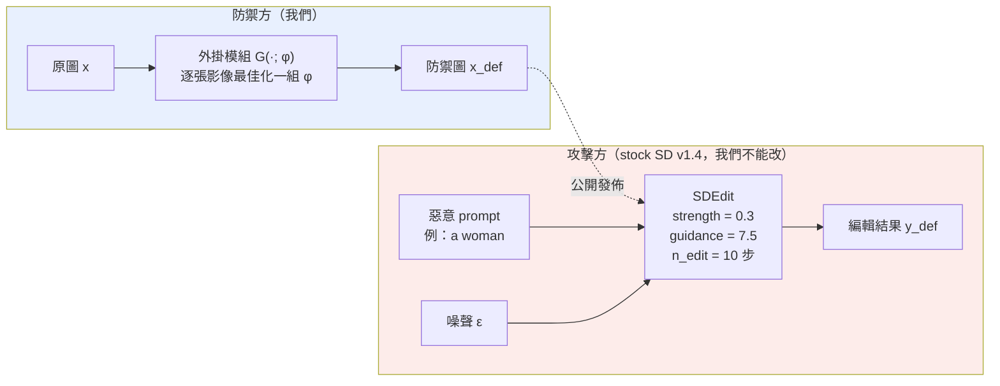
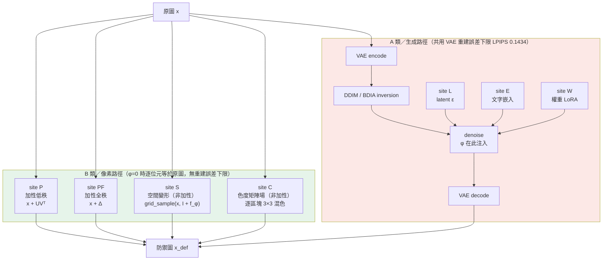
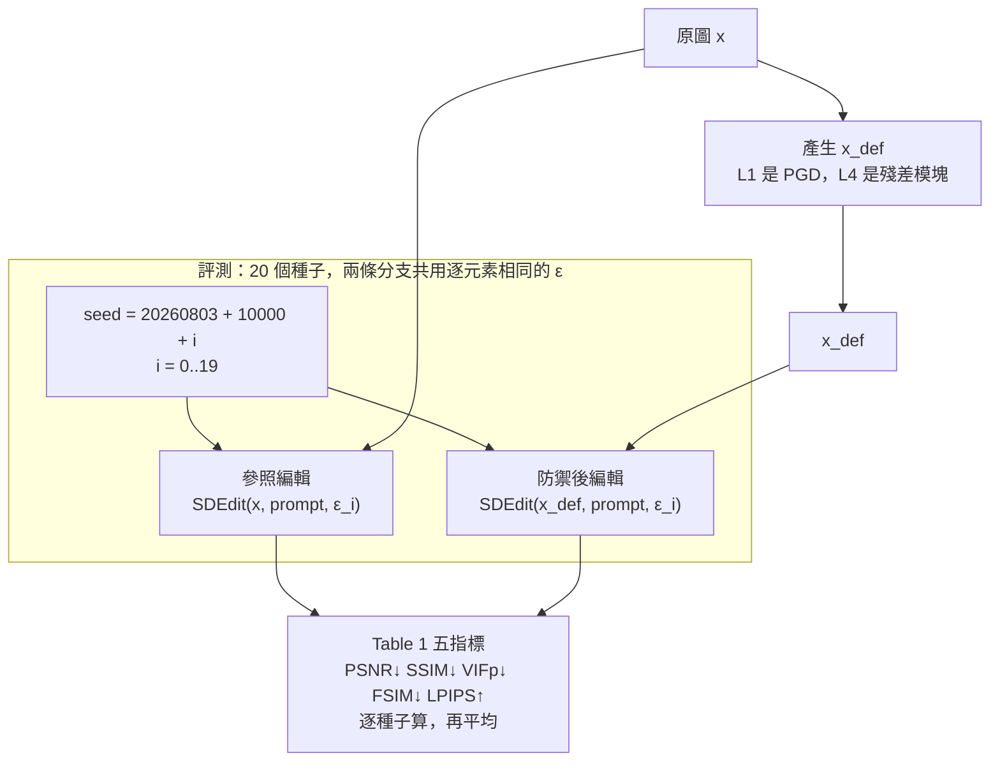
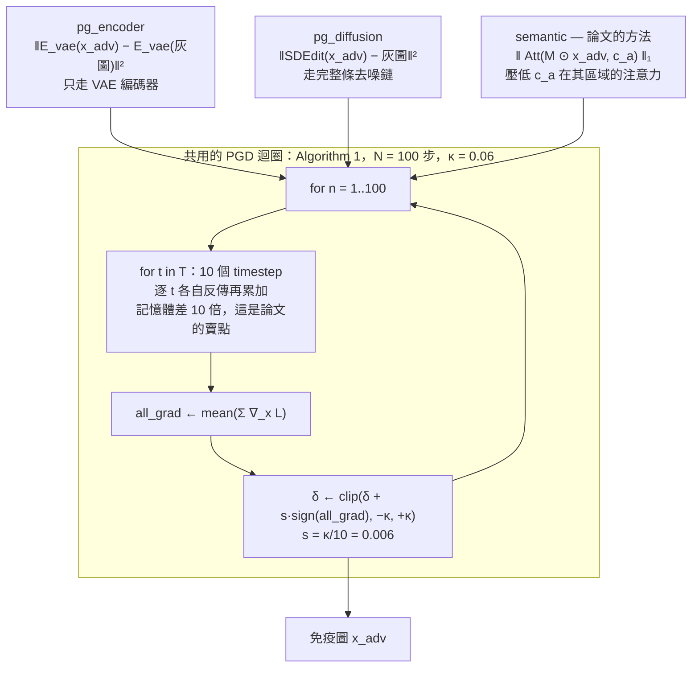
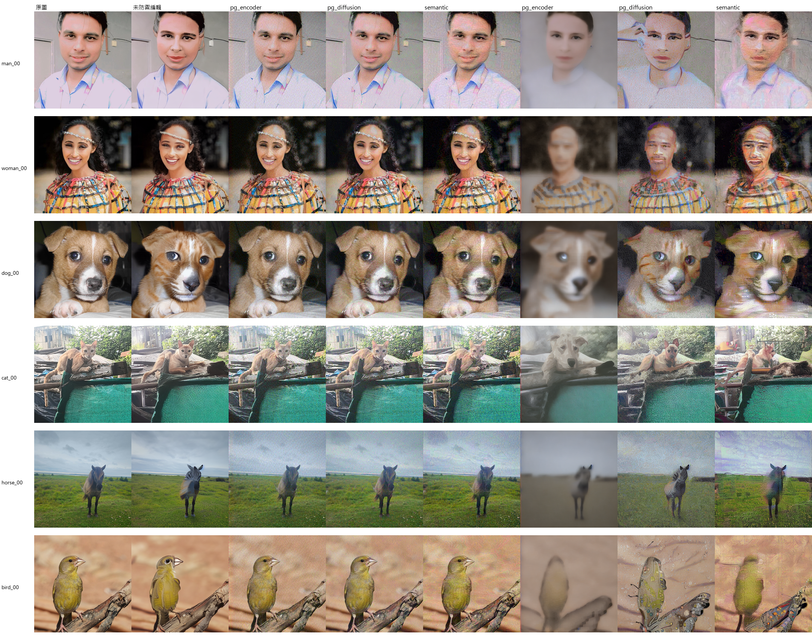
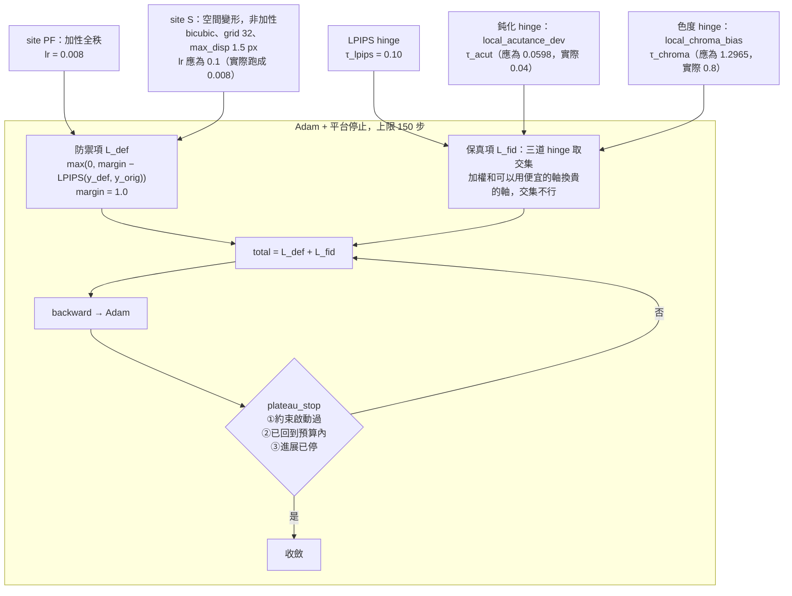
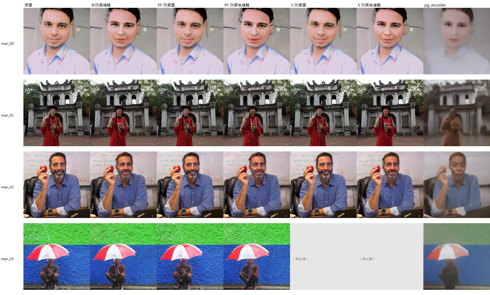

# WACV 專案：從頭到尾的說明

<!-- STATUS-BLOCK -->
| | |
|---|---|
| **狀態** | 現行。2026-08-04 建立 |
| **用途** | 給人讀的完整說明。只收**有效**的實驗與資料；已作廢的只在 §9 列一句 |
| **主張的出處** | `docs/LEDGER.md`。本檔每個判定後面括號裡的編號都指向那裡 |
| **影像來源** | `runs/` 底下真實產生的 PNG。本檔不使用示意圖 |
| **人眼比對頁** | `runs/figs/compare.html`（原尺寸，可放大） |

---

## 目錄

1. [問題是什麼](#1-問題是什麼)
2. [威脅模型](#2-威脅模型)
3. [防禦方的六個注入位置](#3-防禦方的六個注入位置)
4. [評測路徑](#4-評測路徑)
5. [L1：把基準論文的三個基準方法重現出來](#5-l1把基準論文的三個基準方法重現出來)
6. [L4：本專案的兩個位置走同一條路](#6-l4本專案的兩個位置走同一條路)
7. [保真約束：三次「匹配失真」都是假的](#7-保真約束三次匹配失真都是假的)
8. [文獻位置](#8-文獻位置)
9. [已知的失效與作廢的方向](#9-已知的失效與作廢的方向)
10. [困難與規劃](#10-困難與規劃)

---

## 1. 問題是什麼

有人把你的照片拿去用 Stable Diffusion 改掉——把男性改成女性、把狗改成貓、
把人放進失火的房間。**免疫（immunization）** 是在照片公開之前先加一層東西，
使那種改圖失敗。

本專案的研究問題（使用者 2026-07-30 界定，未變）：

> 在白盒條件、外掛模組形式下，找出**非加性**方法，在**匹配人眼可辨失真**下，
> 於抵抗文字引導編輯上勝過加性基準。

三個關鍵詞逐一解釋：

- **加性**指 `x_adv = x + δ`，把一層擾動加到像素值上。文獻上幾乎全部是這一類。
- **非加性**指不是相加的形式，例如把像素往旁邊搬（空間變形）、或改變顏色的
  混合矩陣。本專案的 site S 與 site C 屬於這一類。
- **匹配人眼可辨失真**是比較的前提：兩個方法若一個看起來很髒、一個看不出來，
  比它們誰擋得住編輯沒有意義。要先把「看起來多明顯」拉到同一個水準才能比。

### 為什麼需要「非加性」這個方向

因為量失真的尺對兩類不公平。文獻的標準約束是 L∞ ≤ 16/255，即「任何一個像素
最多改這麼多」。這對加性方法是合理的（改多少就看到多少），對空間變形則完全
失效：把一條邊緣往旁邊移動不到一個像素，L∞ 可以接近 1.0，而人眼幾乎看不出來。

實測數字：`e15_S_tau0.05` 這一格的 L∞ 是 **0.5654**，是 κ = 0.06 的 **9.4 倍**，
而實際位移不到一個像素（LEDGER 2.16）。也就是說，用 L∞ 當共同的球去比較，
等於直接禁止非加性方法工作。

### 論證分兩層，順序不能反

| 層 | 要回答的 | 現況（2026-08-04） |
|---|---|---|
| **第一層：重現** | 在基準論文的協定上，我們的加性實作是否達到他報的水準？ | **兩個 PhotoGuard 變體 已達到或超過**（3.15）。第三個基準方法中的 `semantic` 未重現，原因是協定只跑了一半（3.16） |
| **第二層：貢獻** | 非加性在匹配人眼可辨失真下能否勝過該基準？ | **在 grid 32 這一點上，答案是「沒有」。** 2026-08-04 的閘門取得本專案第一個控制正確的比較（見下），非加性位置的最佳化相對同失真隨機**沒有貢獻**。但容量軸從未掃過（3.29），故那是「grid 32 下的答案」不是「非加性的答案」 |

### 第二層的第一個乾淨結果（2026-08-04）

同一張影像、同一個目標函數、同一組評測種子，兩個條件共用逐元素相同的 ε，
**每個 site 各帶一條「同失真的隨機擾動」對照**：

| site | 擾動 LPIPS | Δsiglip（最佳化） | Δsiglip（隨機） | **優勢** | Cohen d | 同向 |
|---|---|---|---|---|---|---|
| **PF**（加性全秩） | 0.5352 | −0.05674 | −0.04187 | **−0.01487** | **−1.06** | **4/5** |
| **S**（空間變形） | 0.1077 | −0.00212 | −0.00956 | **+0.00744** | +0.23 | **1/5** |

「優勢」=「最佳化」−「同 LPIPS 的隨機」。它**已對各 site 自己達到的失真
正規化**，所以兩者停在 0.535 與 0.108 仍然可比——這繞開了「兩個 site 到不了
同一個失真」這個三個月來的障礙。

> **加性位置的最佳化取得了增益（d = −1.06，大效果）；非加性位置沒有——
> 它比同失真的隨機雜訊還差一點。**

四個候選有效約束已逐項排除（LPIPS 預算 0.108 遠低於 0.55、位移最大 5.386 px
未碰到 8.0 的上界、兩道副 hinge 關閉、lr 用 E14 的校準值），故 site S 的
上限來自**參數化的擾動能力本身**（3.28）。

**而那個能力有一個從未被掃過的參數**：24 次跑過 site S 的實驗
`grid_size` 全部是 32（3.29）。這是下一個實驗。

順序不能反的理由很實際：第一層落後基準時，任何對其判準或設定的質疑都會被
讀成「沒調好就怪尺」。

基準論文是 **Lo, Yeo, Shuai, Cheng, _Distraction is All You Need_, CVPR 2024**。
其第一作者是本專案的指導者，故其約束（L∞ ≤ 0.06）、判準（Table 1 五指標）與
baseline（PhotoGuard 兩變體）已定為必要對齊項。

---

## 2. 威脅模型

**白盒**：防禦方知道攻擊方會用哪個模型（stock SD v1.4），且擁有完整權重。
防禦方不改攻擊方的模型，只在自己這邊掛一個外掛模組。



三個設定值得說明，因為它們都曾設錯過：

| 參數 | 值 | 為什麼是這個值 |
|---|---|---|
| `guidance_scale` | **7.5** | 論文未公布。E26 實測 **w = 1 時 SD v1.4 幾乎不服從 prompt**，該設定下的「編輯」與「什麼都沒做」在指標上分不出來。E2–E23 全部跑在 w = 1，那批等於在防禦一個不存在的攻擊，`edit_*` 全部作廢（LEDGER 3.1／3.2／7.5） |
| `strength` | **0.3** | 論文未公布。Lo et al. §4.3 說設定「similar to [23]」即 PhotoGuard，故取 0.3 而非本專案原本自選的 0.5。**2026-08-04 核對後加註**：PhotoGuard 全文沒有出現 `strength` 一詞，且其主要評測是遮罩式 inpainting；0.2／0.3 這個值可能出自其程式碼而非論文，引用時不應寫成「論文說」（SURVEY §9.1） |
| `n_edit` | **10** | 論文未公布，SDEdit 的去噪步數 |

**攻擊方的 prompt 與防禦方保護的內容是兩個人的東西。** 資料集因此分開宣告：
`data/lo_aligned/prompts.yaml` 每一類同時寫 `content`（防禦方要保護的詞 c_a）
與 `prompts`（攻擊方寫的編輯句）。c_a 猜錯會讓 semantic attack 攻擊到別的
東西而毫無症狀，故該欄為必填、`load_dataset` 不接受預設值。

### 資料集

24 張，六類各 4 張，全部是 **Wikimedia Commons 的 CC0 真實照片**。

| 類別 | c_a | prompt[0]（改掉該內容） | prompt[1]（改動其他區域） |
|---|---|---|---|
| man | man | a woman | a man in a snowy street |
| woman | woman | a man | a woman in a burning room |
| dog | dog | a cat ※ | a dog in the park ※ |
| cat | cat | a dog | a cat on a snowy roof |
| horse | horse | a zebra ※ | a horse and a cow ※ |
| bird | bird | a butterfly | a bird on a flooded street |

※ 沿用論文原文，作為與 Table 1 之間可直接對照的錨點。

**人物類用真實照片，這是有記錄的偏離。** 論文第 1 頁註腳寫「For ethical
considerations, the human face image is synthesized by the diffusion model」。
本專案改用真實照片（使用者 2026-08-03 指定），理由是評測效度：擴散模型生成
的影像本身就落在該模型的分布內，拿它評測「對真實照片的保護效果」會高估。
代價是肖像權——CC0 只放棄著作權，不處理被攝者的人格權，使用應限於學術評測。

---

## 3. 防禦方的六個注入位置

「外掛模組」`G(x; φ)` 可以插在管線的不同地方。本專案實作了六個位置，分成
兩類，差別在於**輸出有沒有經過 VAE 來回**。



### A 類已經是死路，理由是一個下限

A 類的三個位置都要走 `decode(... encode(x) ...)`。VAE 的編解碼來回本身就有
誤差，**φ = 0 時 `G(x; 0)` 與原圖已相差 LPIPS 0.1434 / 27.51 dB**——保真度
預算在 φ 起作用之前就用光了（LEDGER 4.1）。

已經試過的補救與結果：

- BDIA 精確反演已實作並驗證，latent 空間來回誤差降 5 個數量級。**消掉反演
  那一半之後，純 VAE 來回的下限仍是 LPIPS 0.1434。**
- E17 顯示 latent 最佳化可把下限砍到 **0.0760**，但有約 0.075 的真實下限，
  離加性位置實際運作的 0.063 還差約 19%；步數與 lr 都不是瓶頸（4.2）。

**這個下限是我們選的 G 造成的，不是威脅模型強加的。** 攻擊方用 stock SD；
防禦方換掉自己 G 裡的 decode 完全合法。B 類就是這個判斷的產物——空間變形是
非加性的，卻停在像素空間，φ = 0 時逐位元等於原圖。

### 分派靠能力，不靠名字

`src/defense/generator.py` **依模塊提供的能力分派，不比對 site 名稱**：

```python
# src/defense/generator.py:69
if self.module.pixel_residual(x01) is not None:
    return DefenseContext()      # 像素側，不需要 inversion
```

這一行有具體的來歷。原本寫的是 `pixel is not None and self.module.site == "P"`，
新增全秩對照 site `"PF"` 時該條件失效：模塊確實提供 `pixel_residual`，卻因
名稱不是 `"P"` 而被送進 inversion 路徑，於是 φ 完全沒有進入計算圖，backward
只報 `does not require grad`，看不出真正原因。

---

## 4. 評測路徑

這是 L1 與 L4 **共用**的那一段，也是兩邊數字可比的唯一依據。



四個設計要點：

1. **兩條分支必須用逐元素相同的 ε。** 否則量到的差異主要來自噪聲不同，而不是
   防禦。這由 `reference_edits()` 把 `(seed, noise, y_ref)` 一起帶回來保證，
   是結構上的而非約定上的（`scripts/run_lo_baseline.py:110`）。
2. **評測種子與訓練種子錯開 `EVAL_SEED_OFFSET = 10000`。** φ 是針對訓練用的
   那一組 ε 最佳化出來的，評測沿用同一組會量到訓練集表現。本專案實測的噪聲
   過擬合倍率是 **3.3 倍**。
3. **20 個種子，不要降。** SDEdit 對種子高度敏感。曾考慮降到 5，實測只省
   12% 的總時間（三個攻擊占 95% 的成本），卻讓平均值的標準誤差變成兩倍。
   n = 1 是 E29 之前一連串判定問題的來源——n < 2 時 `pstdev` 恆為 0，
   任何「|mean| > sd」的判定自動成立，曾產生 24 格假陽性（1.4）。
4. **三個攻擊共用同一份參照編輯。** `y_ref` 與攻擊方法無關，各自重算一次
   會多耗用三分之一的雲端時間，而且分開算只是靠實作巧合相同、不是結構保證。

### 判準是什麼

Table 1 的五個指標**全部量「免疫後的編輯輸出」與「原始編輯結果」之間的
不相似度**。箭頭是免疫成功的方向，與影像品質相反。

沒有語意判準、沒有 CLIP 分數、沒有使用者研究（1.12）。本專案自己另有兩類
判準（語意軸、感知劣化軸），保留為改良項，但 Table 1 這一類是必要對齊項。

---

## 5. L1：把基準論文的三個基準方法重現出來

**資料：`runs/lo_baseline/`，72/72 格，24 張 × 3 攻擊 × 20 種子。**

三個攻擊共用同一個 PGD 迴圈、同一個 κ = 0.06 與同一個 N = 100 步，差別只在
損失——這是論文 §4.1 的公平比較設定。



**逐 t 各自反傳再累加，而不是把 10 個損失加總後反傳一次。** 兩者梯度相同但
記憶體差 10 倍，記憶體效率正是該論文的主要賣點（其 Figure 6），故實作必須
照其寫法（5.9）。

`semantic` 的三條式子逐項實作在 `src/models/attention.py`：

| 式 | 內容 | 函式 |
|---|---|---|
| (3) | `Att(x, c_a) = Σ_l upsample_bicubic(A_l(x, c_a))`，跨層雙三次上採樣後**相加** | `aggregate_token_attention` |
| (4) | `M = I(Att(x, c_a) > τ)`，由**原圖**的注意力圖二值化 | `attention_region_mask` |
| (5) | `L = ‖Att(M ⊙ x_adv, c_a)‖₁`，遮罩內取 L1 | `masked_attention_l1` |

### 結果

| | PSNR ↓ | SSIM ↓ | VIFp ↓ | FSIM ↓ | LPIPS ↑ |
|---|---|---|---|---|---|
| `pg_encoder`（本專案） | **18.24** | **0.5518** | 0.2857 | **0.6903** | **0.6363** |
| [Lo] PhotoGuard encoder | 18.84 | 0.6318 | **0.2118** | 0.7757 | 0.4131 |
| `pg_diffusion`（本專案） | 18.81 | **0.5351** | **0.0959** | 0.7784 | **0.6070** |
| [Lo] PhotoGuard diffusion | 18.26 | 0.6504 | 0.2656 | **0.7693** | 0.4056 |
| `semantic`（本專案） | 20.23 | 0.5473 | **0.0955** | 0.7854 | 0.5593 |
| [Lo] semantic attack | **15.15** | **0.4470** | 0.1462 | **0.6584** | **0.5901** |

**兩個 PhotoGuard 變體 已重現**：encoder 五項中四項優於論文、diffusion 三項明顯優。
**基準實作不是弱化版**，可作為後續比較對象（3.15）。

**`semantic` 未重現**，五項中四項劣。式 (3)(4)(5) 的解讀、PGD 符號、損失收斂
（下降 87%）已逐項驗過。原因是**協定只跑了一半**：補充材料 §A 每個物件有兩個
編輯 prompt 且 Table 1 兩者一起平均，`runs/lo_baseline/` 只跑
`--prompt_index 0`，即 c_a **不出現**在攻擊方 prompt 裡的那半，而正文 §4.3 把
該情況列為額外優點即承認它較難。兩個 PhotoGuard 變體 不使用 c_a，故不受影響。
使用者已決定不追，`semantic` 改引用論文原數據並標註僅供參考（3.16）。

### 實際看圖：三種完全不同的破壞



*欄序：原圖／未防禦編輯／三個攻擊的免疫圖／三個攻擊的防禦後編輯。
每類第一張。原尺寸見 `runs/figs/compare.html`。*

逐圖判讀的結果與指標排名**不一致**（3.24）：

| 攻擊 | 破壞的樣子 | 編輯有沒有被擋下來 |
|---|---|---|
| `pg_encoder` | 一律是低頻的**模糊褪色**，細節全失 | **多數列無從判斷**——沒有細節可讀。`dog_00__pg_encoder_edit_def.png` 是看得出擋下來的一張：prompt 是「a cat」，輸出仍是一隻（模糊的）狗 |
| `pg_diffusion` | 保留結構、疊上**雜訊與重影** | 逐張看多半**沒擋住**：`cat_00`（→ a dog）輸出是狗、`horse_00`（→ a zebra）輸出是有條紋的斑馬。更值得記的是有兩張**比未防禦時更成功**（見下） |
| `semantic` | 保留構圖、產生**色帶撕裂** | `man_00__semantic_edit_def.png` 是清楚擋下語意改變的一張：未防禦編輯是塗口紅、盤髮的女性，防禦後仍是短髮男性。其餘多半沒擋住 |

**兩張「保護反而幫了攻擊方」的直接證據**（單一種子，逐檔可查）：

| 檔案 | prompt | 未防禦編輯 | pg_diffusion 防禦後編輯 |
|---|---|---|---|
| `woman_00__pg_diffusion_edit_def.png` | a man | **仍是女性**（編輯失敗） | **清楚是男性**（短髮、鬍髭）——編輯因為有保護才成功 |
| `bird_00__pg_diffusion_edit_def.png` | a butterfly | 仍是鳥 | **整隻蝴蝶** |

**這說明 Table 1 的距離判準分不出「編輯被擋下來」與「輸出被毀掉」。**
該判準把 `pg_encoder` 排第一（0.6363），而它的高分是用全域由模糊換來的。
本專案另有一份量測支持同一件事：三類判準之間 ρ(距離, 語意) = 0.140、
**ρ(距離, 劣化) = −0.207**、ρ(語意, 劣化) = 0.014，n = 217（1.10）。

`pg_diffusion` 讓兩列的編輯**更成功**這一項不是孤例：ICIP 2025
（arXiv:2506.04394）測 PhotoGuard／Mist／Glaze，量到 **61.82–67.79% 的受保護
影像更服從 prompt**。本專案在自己的資料上、在基準論文自己的協定與預算上
獨立看到同一現象（3.25）。

> **判讀的粒度限制。** 上面的圖是**單一評測種子**（存的是第一個種子），
> 而指標是 20 種子平均。逐圖判讀給的是「破壞的型態」，不是效果量。

### 把同一批資料放到另外兩類判準上（L3）

`runs/lo_baseline/results.csv` 的 1440 列在跑 L1 時就一起寫出了
`edit_siglip_*` 與 `edit_niqe_*`，即語意軸與劣化軸的原始欄位。
把它們算出來（`scripts/l3_criterion_axes.py`，零 GPU）：

| 攻擊 | 距離（編輯 LPIPS） | 語意（Δsiglip，越負越好） | 劣化（Δniqe，越正越「成功」） | 語意失敗 | 劣化失敗 |
|---|---|---|---|---|---|
| `pg_encoder` | **0.6395** | +0.0066 | **+5.75** | 1/18 | **17/18** |
| `pg_diffusion` | 0.6029 | +0.0091 | +0.66 | 0/18 | 7/18 |
| `semantic` | 0.5558 | **−0.0124** | −0.51 | **6/18** | 5/18 |

（只取未防禦編輯明顯成功的 18 張，理由見下。）

**四件事：**

1. **語意軸挑得出方法的機制，距離軸挑不出來。** `semantic` 是三者中唯一
   以 cross-attention 綁定為目標的，也是唯一在語意軸上得分的（6/18，
   對 1/18 與 0/18）。而 Table 1 把它排**最後**（LEDGER 1.15）。
2. **兩個 PhotoGuard 變體 的 Δsiglip 是正的**，即免疫後的編輯**更**服從 prompt。
   這是 ICIP 2025 的白盒複現，且有逐檔影像佐證（1.18、3.26）。
3. **ISR 由劣化那一半主導。** `pg_encoder` 劣化失敗 17/18、Δniqe +5.75，
   即以 ISR 計它的「免疫成功率」約 94%，而那 94% 幾乎全是「輸出看起來很糟」
   （1.17）。這解釋了文獻 ISR 79–97% 與人類偏好勝率 41.9% 之間的落差。
4. **三類判準互不一致**，且過濾之後 ρ(距離, 劣化) 在三個方法上**一致為負**
   （−0.12 到 −0.36）：輸出被推得越遠反而越不劣化（1.16）。

### 一道本專案原本沒做的過濾

Attention Attack（ACM MM 2025）建資料集時明說要**先排除未防禦編輯本來就
失敗的影像**。本專案沒有做。實測（`scripts/l3_edit_success.py`，數秒）：

    edit_effect = SigLIP(未防禦編輯, prompt) − SigLIP(原圖, prompt)

24 張裡有 **6 張**未達 E25 量到的標準差 0.0237，其中 `dog_03` 是
**−0.0007**（編輯反而更遠離 prompt）。**在這些影像上量免疫效果沒有意義。**

過濾之後上表每一項都更乾淨——`semantic` 的 Δsiglip 由 +0.0001 轉為
−0.0124。**結論變強而不是變弱，這本身是該過濾為真的旁證**（1.22）。

### κ = 0.06 不是不可察覺的

對抗擾動文獻普遍把 L∞ 球描述為 imperceptible。**在本專案的影像上不成立。**

| 目標 L∞ | ×κ | LPIPS | PSNR | 使用者判讀 |
|---|---|---|---|---|
| 0.045 | 0.75 | 0.5318 | 29.64 | 「比較可以接受」 |
| **0.060** | **1.00** | **0.5817** | **27.14** | 「**一眼看出**背景扭曲，但不會到令人很不舒服」 |

資料在 `runs/p17_kappa_visibility/ladder.png`（2.18／2.21）。L1 實測三個基準方法
的擾動 LPIPS 是 **0.5080–0.5514**，與該階梯一致。

這使「匹配人眼可辨失真」這個研究問題更站得住：領域慣用的預算對應到的失真
**不是**不可見的，所以在該預算上宣稱「免疫成功」時，代價沒有被計價。

---

## 6. L4：本專案的兩個位置走同一條路

**資料：`runs/ours_lo/`，7 格。機器時間用盡，未跑完。**

L4 只換掉產生 `x_def` 的那一步，其餘（參照編輯、種子偏移、步數、guidance、
指標）與 L1 逐字相同。



**三道 hinge 取交集而不是加權和。** 加權和永遠可以用便宜的軸換貴的軸，那正是
E18／E19 觀察到的行為；交集式的可行域不允許這種交換（2.7）。

### 逐格結果

| 影像 | site | 步數 | 收斂 | 擾動 LPIPS | 編輯 LPIPS |
|---|---|---|---|---|---|
| man_00 | PF | 48 | **是** | 0.0992 | 0.2490 |
| man_03 | PF | 122 | **是** | 0.0843 | 0.2524 |
| man_01 | PF | 150 | 否 | — | — |
| man_02 | PF | 150 | 否 | — | — |
| man_00 / man_01 / man_02 | S | 150 | 否 | — | — |

**跑滿步數上限的格子不可用於跨 site 比較**（6.4）：量到的是「這個步長走到
哪裡」而不是「該位置在此預算下的能力」。E21–E23 §5.4 有直接證據——τ = 0.05
由 25 步改到 100 步後，site S 對 site P 的比值由 1.14× **反轉為** 0.85×。

### 這一輪最重要的發現：非加性位置零格可用

**site S 的三格，三道 hinge 在 450 個訓練步裡一次都沒有啟動。**

```
man_00__S   steps=150  lpips=0.0163  acut=0.0257  chroma=0.0839
            啟動 {pen_lpips: 0/150, pen_acut: 0/150, pen_chroma: 0/150}
man_01__S   steps=150  lpips=0.0250  acut=0.0141  chroma=0.0654
            啟動 {pen_lpips: 0/150, pen_acut: 0/150, pen_chroma: 0/150}
man_02__S   steps=150  lpips=0.0178  acut=0.0360  chroma=0.1144
            啟動 {pen_lpips: 0/150, pen_acut: 0/150, pen_chroma: 0/150}
```

末端 LPIPS 只有 0.0163–0.0250，**即預算 0.10 的 16–25%**。沒有任何一道約束
綁住它，它只是走不動。

原因是學習率。`φ` 的量綱逐 site 不同：site PF 的 φ 是像素值（[0,1] 尺度），
site S 的 φ 是**位移像素**。E14 在同一判準下掃描出 site S 的校準值是 **0.1**、
site P/PF 是 **0.008**，相差 12.5 倍，E21／E22 全部照此執行。而
`runs/ours_lo/` 兩個 site 共用 0.008——**非加性位置跑在其校準值的 1/12.5**
（6.16）。

而且「跑滿上限」對這種格子**不是未收斂的證據**：`plateau_stop` 的條件一要求
觀察窗內某一步的懲罰大於零，三道 hinge 全程為零時該條件恆為 False，函式
永遠回傳「不停」，該格必定用盡 `steps`（6.18）。

**這推翻了先前的判定 3.19「綁住 site S 的是鈍化約束」**（記在 LEDGER 7.10）。
數字（0.0414、16%、跑滿上限）是真的，解釋是錯的。修正後的判定是 3.23：
**L4 的非加性側目前是零格可用，「非加性弱六倍」不是量測結果而是設定錯誤。**

### 實際看圖：加性位置在這個預算下也沒擋住



*欄序：原圖／未防禦編輯／PF 防禦圖／PF 防禦後編輯／S 防禦圖／S 防禦後編輯／
基準 pg_encoder 的防禦後編輯。man_03 的 site S 沒跑到。*

三件看得到的事（3.20／3.22）：

1. **保真側是成功的。** PF 的防禦圖（第 3 欄）在 1:1 下與原圖幾乎無法分辨，
   擾動 LPIPS 0.0928；相對地基準 pg_encoder 的免疫圖有明顯雜訊（0.5123）。
   S 的防禦圖（第 5 欄）更看不出來，擾動 LPIPS 只有 0.0197。
2. **防禦側沒有效果。** man_00 的編輯 prompt 是「a woman」，未防禦編輯把人變成
   女性，而 **PF 與 S 的防禦後編輯同樣是女性、與未防禦結果幾乎一樣**。
   man_01、man_02 同。編輯 LPIPS 0.2490 聽起來像「有部分效果」，肉眼是
   「編輯照樣成功，只是細節略有不同」——**該指標在此高估了防禦效果**。
3. **對照組的破壞是全面的。** 最右欄的 pg_encoder 把整張圖糊到無法辨識。

**結論不是「保真約束太緊」，而是「該預算下的防禦目標函數做不出效果」。**

> **兩者不在同一條軸上。** 基準的擾動 LPIPS 是 0.55，本條件綁在 0.10，
> **失真差 5.4 倍**。這不是勝負判定，只是兩條曲線各有了一個錨點。

---

## 7. 保真約束：三次「匹配失真」都是假的

這是本專案在方法學上走得最遠的一塊，也是最容易被跳過的一塊。

**用單一純量定義「匹配失真」，在失真種類不同的兩類之間不成立**（2.1）。
已經被證明三次：

| 次 | 誰在作弊 | 換到了什麼 | 怎麼抓到的 |
|---|---|---|---|
| 1 | site S | **模糊** | E20 的等 LPIPS 四條件探針。E21 進一步量出 site S 的 net 有 67.3% 來自模糊 |
| 2 | site C | **色調偏移** | E27。同一個 LPIPS 下 site C 的防禦圖有人眼可見的色偏、site P 沒有 |
| 3 | site C | 同上，且既有兩道約束**構造上**擋不住 | E28。`local_acutance_dev` 只看 Rec.601 亮度，純色度變化使它恆為 0 |

### 判別的方法：等 LPIPS 多條件探針

把幾種不同的失真（模糊／雜訊／變形-雙線性／變形-雙三次／色度偏移）全部校準
到**同一個 LPIPS**，再看各個候選指標對它們各收多少費。這樣才知道一個指標
實際在量什麼，而不是靠它的文獻聲譽（2.2／1.9）。

判別的關鍵：雙三次變形比雙線性銳利 15 個百分點（99.9% vs 85.0%），故**真的在
量鈍化的指標必須對雙三次收費較低**。結果：

- **GMSD、NLPD、HaarPSI、VIF、SSIM、DISTS、PSNR 全部對雙三次收費更高**
  ——它們量的是幾何位移，不是鈍化（2.5、7.8）。
- **SSIM 把雜訊判得比等 LPIPS 的模糊貴約 2 倍**，即先前的保真項在**補貼**
  模糊：選模糊比選等量的加性擾動更便宜（2.6）。SSIM 因此由 α = 1.0 改為 0.0。
- **ΔE00 是色差的國際標準，實測分不出加性雜訊（2.44）與可見色偏（2.79）**
  ——因為雜訊也在每個像素上擾動 (a*, b*)。人眼在意的是空間上連貫的色偏（1.9、7.7）。

通過判別的兩個：

| 指標 | 定義 | 為什麼通過 |
|---|---|---|
| `local_acutance_dev` | 逐 32×32 區塊的梯度能量比，以原圖能量加權取絕對偏差 | 對位移不敏感（位移把梯度在區塊內搬動、不搬出區塊），且先取絕對值再加權，無法被「一處變鈍、他處變銳」抵銷（2.3） |
| `local_chroma_bias` | 先在 32×32 區塊內對有號的 (Δa*, Δb*) 取平均、再取量值 | 隨機雜訊在區塊內相消，連貫的偏壓不會。五個條件實測的分離度是 13.99，ΔE 那一類只有 0.89–1.14（2.4） |

### 兩道門檻都是人眼判讀出來的

| 門檻 | 值 | 人眼判讀的原話（使用者） |
|---|---|---|
| τ_chroma | 0.8 | 「0.3 還有 0.6 都看不出來，1.0 以上才開始有一些細微色調變化⋯⋯1.0 要很仔細看才看得出來，可以直接取 0.8 或 1.0」 |
| τ_acut | 0.04 | 由四條件探針的可行域定出：site P 實測 0.0089 ± 0.0030、雙三次變形 0.0296 須通過；雙線性 0.1497 與純模糊 0.2356 須被擋下 |

取 0.8 而非 1.0 的理由：1.0 屬於**已確認看得見**的一級（即使需要仔細看），
把門檻設在該處等於允許約束放行一個可見的失真。

### 門檻必須隨預算而變，而這一輪發現它沒有

兩道副約束的職責是**相對的**——擋住最佳化去換 LPIPS 收費不足的兩種失真。
故門檻應隨預算而定（2.10）。p14 已經把逐預算的值量出來：

| LPIPS 預算 | τ_acut | τ_chroma |
|---|---|---|
| 0.05 | 0.0400 | 0.80 |
| **0.10** | **0.0598** | **1.2965** |
| 0.28 | 0.1460 | 3.6653 |

**但 `runs/ours_lo/` 跑在 τ_lpips = 0.10，卻沿用了 0.05 的門檻。** 後果讀得
到：man_00/PF 的鈍化 hinge 啟動 31/48 步、man_01/PF 的色度 hinge 啟動
25/150 步、man_02/PF 31/150 步——**兩道副約束確實成了有效約束**（6.17）。

還有一個一般性的發現：**acut 軸的分離度隨預算塌掉**。0.05 時「該擋下的」是
「該通過的」的 5.12 倍，0.28 時只剩 1.39 倍。機制是加性雜訊的 acut 隨振幅
陡升（14 倍）而幾何變形飽和（1.28 倍）（2.13）。

**這說明「匹配失真」這個概念本身有一個預算上限。** 這是本專案最原創的一項
量測，文獻上沒有人做過。

---

## 8. 文獻位置

完整的調查在 `docs/SURVEY.md`（按問句組織，不做逐篇摘要）。此處只摘與本專案
方向直接相關的六件事。

### 8.1 這條線多半擋不住編輯，而且方向可能是反的

- **ICIP 2025**（arXiv:2506.04394）測 PhotoGuard／Mist／Glaze，
  **61.82–67.79% 的受保護影像對 prompt 的對齊度上升**。
- **DiffusionGuard**（ICLR 2025）在 inpainting 上的人類偏好勝率是 41.9%，
  對照 PhotoGuard 的 25.0%。**勝率 42% 不是「擋下來了」，是「比另一個好一點」。**
- 本專案 §6 的否定結果因此**不是實作瑕疵，是已知現象的白盒複現**。

### 8.2 判準：領域還沒收斂，三類並存

| 判準類別 | 代表 | 量的是 |
|---|---|---|
| 與未防禦編輯的**距離** | 基準論文 Table 1、TDAE（TPAMI 2026） | 輸出移動了多少 |
| 影像—文字**對齊** | ICIP 2025 的 CLIP-S／PAC-S++ | 輸出服不服從 prompt |
| **聯集式**（語意不符 **或** 感知劣化） | SIFM 的 ISR | 兩者取聯集 |

本專案在第二類上有一個自己的量測：**CLIP 分不出「編輯有沒有發生」**
（edit_effect +0.0101 ± 0.0169，標準差大於均值），**SigLIP 通過同一個對照**
（+0.0276 ± 0.0237）（1.2／1.3）。

MLLM 判準的可靠度也有數字：SIFM 報 ISR 的**人類—MLLM 一致率 74%，而人類彼此
是 76%**——即 MLLM 與人類的差距小於人類之間本來就有的分歧。

### 8.3 目標函數至少四類，本專案只跑過一類

| 類 | 形式 | 代表 | 本專案 |
|---|---|---|---|
| A. 無目標輸出距離 | `max d(y_def, y_orig)` | PhotoGuard diffusion 的無目標變體、TDAE | **只有這一類跑過。** 59 個有記錄的 `env.json` 100% 是它 |
| B. 有目標 | `min d(y_def, y_target)`，y_target 常取灰圖 | PhotoGuard encoder／diffusion | 已實作、有測試，**本專案的條件從未在真實 SD 上跑過**（L1 的兩個基準方法是這一類） |
| C. 表示層／注意力 | 壓低內容 token 的注意力質量 | Attention Attack（ACM MM 2025）、DANP、SIFM | `suppress` 已實作，**從未跑過** |
| D. 早期步的噪聲預測 | 只在**第一個**去噪步施力 | DiffusionGuard、SDA | **從未考慮過** |

**A 類最大化的正是已被判定與防禦成功不對應的量**（`edit_shift`）。E25 之後
判準改了，目標函數沒有跟著改（5.1）。這是一個尚未處理的結構性問題。

D 類值得單獨記：DiffusionGuard 攻擊預測噪聲的 L2 範數、SDA 攻擊 self-attention
的 query，兩者獨立提出、著力點不同，但共用同一個假設——**初期去噪步決定整體
佈局，破壞它就夠了**。成本結構與 `crossattn` 相同（不跑完整條鏈）。

順帶暴露本專案的一個可疑設定：`optimize.py` 的
`t_list = linspace(0, t_edit, attn_timesteps+1)[1:]` 把力氣**均分**於整個
`[0, t_edit]`，而文獻的成功案例都集中在**最高的那個 t**。這是一行改動即可
檢驗的假設（9.8）。

### 8.4 失真預算：兩個軸，本專案在兩軸上的位置相反

| 軸 | 本專案（τ = 0.10） | 文獻 | 比 |
|---|---|---|---|
| LPIPS | 0.0856 | 0.267–0.362 | 低 3–4 倍 |
| RMS | 0.0319 | 約 0.06 | 低 2 倍 |
| **L∞** | **0.373** | **0.063** | **高 6 倍** |
| 超過 16/255 的像素比例 | 5.3% | 接近 100% | — |

**「本專案的預算比文獻低」只在 LPIPS 上成立。** 本專案的擾動是稀疏尖峰型，
這是 `beta_linf = 0` 的直接後果。跨論文比較預算時必須同時報兩個軸（3.6、7.6）。

### 8.5 威脅模型：本專案選了最難的那一個

| 設定 | 文獻主流 | 本專案 |
|---|---|---|
| 編輯型態 | **遮罩式 inpainting** | 全域 SDEdit |
| strength | 0.2–0.3 | 0.3（L1 起；先前是 0.5） |
| 攻擊方模型 | SD v1.5／v2／SDXL／SD3 | stock SD v1.4 |

**inpainting 對防禦方有結構性優勢**：遮罩外的區域保留原像素，擾動整片留在
條件裡。SDA 的動機就是「全域擾動在遮罩式編輯上失效」——注意方向相反。
**兩種設定的失效機制不同，不可互相引用結論**（9.6）。

全域 SDEdit 下沒有遮罩，擾動全部參與，但也全部被 strength 決定的噪聲稀釋。
在這個設定下要求「輸出語意不符 prompt」，接近要求防禦壓過整條文字條件。

### 8.6 非加性：這條線 2025–2026 才被明確提出

- **STP-Diff**（Information Fusion 2025）以幾何扭曲像素座標取代加性雜訊，
  **參數化與本專案的 site S 是同一個構想**——但它防的是**人臉辨識系統**、
  威脅模型是**黑盒**、判準是 Privacy Similarity Ratio，三項都與本專案不同。
  它證明「空間變形作為非加性擾動類可用」，不證明「它在抗編輯上有效」。
- **NAPPure**（arXiv:2510.14025）從**淨化側**處理非加性擾動——它的存在本身
  說明非加性已被視為需要專門處理的一類。
- **Interpreting Structured Perturbations**（arXiv:2512.08329）**不是**這條線的
  支持文獻。2026-08-04 逐項核對後發現先前的引用有誤：該文全文唯一的
  `non-additive` 指的是「把兩種保護疊加時偵測行為的非加性」，其 future work
  講的是 spectrally diffuse 與 entropy-adaptive 的**規避偵測**方向，
  而且它評測的是 Glaze／Nightshade／Mist 即風格模仿那一類。詳見
  `docs/SURVEY.md` §7 的修正說明。

**逐篇核對之後，「非加性用於抗文字編輯」這條線查不到直接的前作。**
這對新穎性有利，但也意味著沒有外部結果可以借用——site S 至今沒有正面結果
這件事，在文獻上沒有對照可比。

**本專案在量測方法上走得比較遠。** 等 LPIPS 多條件探針、`local_acutance_dev`、
`local_chroma_bias` 三項是為了回答「非加性以什麼代價換得它的效果」而做的，
上列論文都沒有處理這個問題——STP-Diff 只報 FID 與 PSR，而 §7 已證明 SSIM
這類指標會補貼模糊。**再加上一項 2026-08-04 的量測**：PhotoGuard 的 Table 6 確實有隨機雜訊
對照，但它匹配的是**振幅**；本專案把高斯雜訊匹配到相同的 **LPIPS**，
隨機就取得最佳化解 60–74% 的語意失效（LEDGER 1.20、1.24）。
兩者一致——同振幅時隨機的可辨失真只有最佳化解的 1/2 到 1/3（2.19）。

---

## 9. 已知的失效與作廢的方向

這些**不進主線**，但接手的人需要知道它們存在，才不會重複。

| 項目 | 影響範圍 | 判定 |
|---|---|---|
| **攻擊端沒有 classifier-free guidance** | E2–E23 全部 | w = 1 時 SD v1.4 幾乎不服從 prompt。那批的每一個 `edit_*` 失效（3.2／7.5）。`report_table1.py` 現在會自動把它們分到「不可用」那張表 |
| **`net_lpips`／`edit_shift` 當判準** | E2–E29 | 兩次量到它與編輯是否失敗不對應（1.1）。在死路清單上 |
| **A 類（site L/E/W）** | E17–E19 | VAE 重建誤差下限高於加性運作點（4.1）。在死路清單上 |
| **low rank** | E8 系列 | 使用者 2026-07-30 明確排除。`e8_rank_*`（24 MB）保留為該結論的唯一證據 |
| **E29／E30／E31 的網格** | 三份設計 | E29 判準未通過（site C 六個學習率全部由色度 hinge 綁住）、E30 未執行、E31 的 12 格盲搜由 L1 取代。四支 driver 頂端都已加註「不要執行」 |
| **`runs/ours_lo_linfbound/`** | L4 負對照 | 綁定約束錯成 L∞（`beta_linf` 未覆寫）。site S 停在擾動 LPIPS 0.0034，即預算的 1/29（6.12） |
| **`runs/ours_lo_earlystop/`** | L4 負對照 | 停止準則在約束仍被違反時觸發（6.13），且 site PF 用了會震盪的 lr 0.03（6.14）。**它的每個數字都比正確的那批好看**（PF 編輯 LPIPS 0.4372 對 0.2593），因為它停在 3.3 倍預算的失真上 |

### 一個反覆出現的缺陷型態

上表最後三列與 §6 的發現是**同一個型態**：一個為了讓舊 run 可重現而保留的
預設值，被新的驅動沿用，實驗照常跑完、CSV 照常寫出、**沒有任何症狀**，只有
結果不是在回答原本要問的問題。至今出現過**九次**，而且型態完全一樣——
**一個為某個對象校準的值，被沿用到另一個對象上**：

| # | 值 | 沿用到哪裡 | 後果 | 帳號 |
|---|---|---|---|---|
| 1 | `beta_linf = 100.0` | 非加性位置 | L∞ 而非 LPIPS 成為綁定約束 | 6.12 |
| 2 | `alpha_lpips = 1.0` | 匹配失真的比較 | 預算永遠用不滿，τ 不是匹配軸 | 6.12 |
| 3 | `plateau_stop` 只檢查「啟動過」 | 匹配失真的比較 | 停在超標的失真上 | 6.13 |
| 4 | site P 的 `lr = 0.03` | site PF（全秩） | 震盪不收斂，必撞步數上限 | 6.14 |
| 5 | **一個 lr** | **全部 site** | site S 跑在校準值的 1/12.5，三道約束一次都沒啟動 | 6.16 |
| 6 | **τ_lpips = 0.05 的 τ_acut／τ_chroma** | **τ_lpips = 0.10** | 兩道副約束變成真正的有效約束 | 6.17 |
| 7 | `L∞ hinge`（E13）、8 `max_dev`／防禦 margin（E27） | 各自的網格 | 每一格被不同的東西綁住 | 6.2 |
| 9 | **`edit_shift` 的 `stop_tol = 1e-4`** | **`attn_div`**（動態範圍小 39 倍） | crossattn 在第 30/60 步就判定「已收斂」 | 6.21 |

**處置**：1–4、7–8 已於 2026-08-03 之前修好；5、6、9 於 2026-08-04 修好，
作法都一樣——**把「這個值是為誰校準的」寫成程式讀得到的表，未校準的對象
直接拋出**（`SITE_LR`、`p14` 的逐預算門檻、`MONITOR_TOL`）。同時修掉
`run_defense.load_images` 的兩個無症狀缺陷：`list(dict)` 把**鍵名**當 prompt、
以及 `rglob("*.png")` 把 `overview.png` 當資料集影像（6.19）。

---

## 10. 困難與規劃

### 10.1 三個真正的困難

**困難一：判準本身有問題，但現在還不能拿它當擋箭牌。**

Table 1 的距離判準分不出「編輯被擋下來」與「輸出被毀掉」（§5 的逐圖判讀），
而且與另兩類判準幾乎不相關甚至負相關（ρ = −0.207）。但這個論點的提出時機
很敏感：在自己的重現落後基準時提出，會被讀成「沒調好就怪尺」。

**現在的狀態是：兩個 PhotoGuard 變體 已重現，這道限制對它們已解除。** §5 的逐圖
判讀是在**基準自己的協定與預算上**取得的直接證據，不是拿自己的失敗去質疑尺。
`semantic` 那一個仍未重現，涉及它的比較維持不提出。

**困難二：目標函數這一類本身可能就是錯的。**

本專案跑過的 59 個有記錄的 run **100% 是無目標輸出距離**（A 類），而它最大化
的正是已被判定與防禦成功不對應的量。E25 之後判準改了，目標函數沒有跟著改
（5.1）。另外三類（有目標、注意力、早期步）都已實作或有現成文獻，**但本專案
的條件從未在真實 SD 上跑過任何一個**。

**困難三：全域 SDEdit 是文獻中最難的設定。**

文獻的成功案例集中在遮罩式 inpainting 與低 strength。全域 SDEdit 下擾動全部
被噪聲稀釋，而 prompt 有很大的自由度重新生成內容。要求「輸出語意不符 prompt」
接近要求防禦壓過整條文字條件。這不是可以靠調參解決的量級差距。

### 10.2 下一步，依優先序（2026-08-04 改寫）

完整的推導在 **`docs/CONVERGENCE.md`**。摘要如下——**前三項都在本機跑得動**：

| # | 做什麼 | 在哪跑 | 為什麼是這個順序 |
|---|---|---|---|
| **1** | 把閘門的評測種子由 5 加到 20（`scripts/gate_reeval.py`） | **本機約 40 分** | 配對分析說要分辨「最佳化」與「同失真的隨機」需要 n ≈ 7–10，現在是 5（1.23）。**不需要重新訓練**——`x_def` 已存檔。這一步就能把一個 d = −1.06 但樣本不足的結果變成可以寫下來的判定 |
| **2** | 閘門加跑 **site S**（同預算、同目標、同隨機對照） | **本機約 1.5 小時** | 研究問題本身的第一個資料點：非加性在匹配失真上對加性 |
| **3** | 隨機基線曲線擴到 6 張影像 | **本機**，不需訓練 | PhotoGuard 有隨機對照但匹配的是**振幅**；匹配**感知失真**的版本沒有人做過，而那正是本專案的比較軸（1.24） |
| **4** | 重跑 L4（L4′）：逐 site lr、逐預算門檻、改用 `suppress` | 雲端 | 設定已修好且有測試釘住。目標函數改用 `suppress` 不是偏好而是修正——`untargeted` 在起點的梯度精確為零（5.10） |
| **5** | L5：匹配失真的掃描 | 雲端 | 要等 1–4 有結果才有意義 |

**不做的事**（規格 §7）：低秩的任何深究、新的注入位置、新的目標函數類、
用 MLLM 補判準、抗淨化的擴充。過去三個月最貴的支出是發散，不是失敗。

**每一個比較都要有同失真的隨機對照。** 這是 2026-08-04 新增的規則，
理由是 `e2_phi0` 那一課（7.1）的重演：沒有它，「加了這麼多失真」與
「最佳化找到的方向」分不出來（1.18）。

### 10.3 如果 L4′ 仍然是負的

那手上會有一份完整的否定結果，而這類論文在這個領域是進得了場的
（USENIX Security 2024、NeurIPS 2024、ICLR 2025、ICIP 2025 各有先例）。
已有的資產：

1. **判準的證偽。** 兩次獨立量到距離判準與編輯是否失敗不對應，
   加上 §5 在基準自己協定上的逐圖判讀。而 2026 年的 TPAMI 論文仍在用那一類。
2. **保真約束的方法學。** 等 LPIPS 多條件探針、`local_acutance_dev`、
   `local_chroma_bias`，以及「匹配失真三次被證明是假的」的完整紀錄。
   **沒有其他論文處理過「非加性以什麼代價換得它的效果」這個問題。**
3. **逐預算門檻，以及它的失效。** 門檻定出規則在 chroma 軸獨立重現了人眼判定
   （0.802 對 0.8），而 acut 軸的分離度隨預算塌掉——後者說明**「匹配失真」
   這個概念本身有一個預算上限**。這是最原創的一項。
4. **κ 的人眼判讀。** 對抗擾動文獻普遍稱 L∞ 球為 imperceptible，
   而 κ = 0.06 在本測試上一眼可辨（LPIPS 0.58）。
5. **有效約束診斷。** 六個誤判的有效約束的完整案例（§9）。
6. **外部佐證。** ICIP 2025 與 Off-The-Shelf 2026，本專案的否定結果不是孤例。

缺的只有一項：**在修正後的設定上把非加性位置真的跑一次**。那就是第 1 步。

---

## 附錄：怎麼重跑本檔的每一張表與圖

全部只讀 `runs/` 底下既有的 CSV 與 PNG，不需要 GPU：

```bash
# Table 1 對照表（含可用性判定與逐格步數）
python scripts/report_table1.py --out docs/RESULTS_TABLE1.md

# 人眼比對頁與本檔的兩張大圖
python scripts/lo_compare_page.py

# 測試（基準 346 passed / 1 skipped）
python -m pytest -q
```

Windows 上一律加 `PYTHONIOENCODING=utf-8`——cp950 編不了 `²` 這類字元，
症狀是腳本在**印出結果時**才炸，前面的計算全部白做（6.9）。
