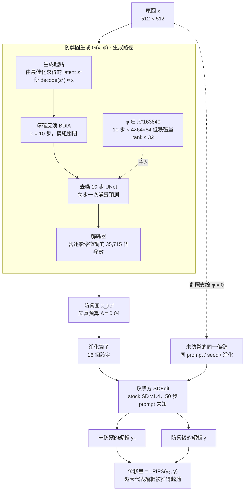

# 非加性抗文字編輯防禦：注意力抑制與目標輸出兩種訓練目標的比較

> Stable Diffusion v1.4 · 512² · fp32 · strength 0.4 · 失真預算 Δ = 0.04（相對 DISTS） · 3 影像 × 5 種子 × 15 個淨化設定 · 2026-08-11

在固定的參數化、失真預算與保真約束下，唯一的變因是防禦項 `L_def`。主指標為**位移量**——防禦後的編輯輸出離未防禦的編輯輸出多遠。

[TOC]

## 摘要

- :x: **兩個訓練目標都沒有產生可用的抗編輯效果。**不淨化時位移量：注意力抑制 `0.1010`、目標輸出 `0.0776`、隨機對照 `0.0646`。最佳化相對隨機的增益是 1.56× 與 1.20×，而外部參照的加性方法是 0.24–0.36。
- :x: **與評測指標對齊的損失反而更差。**目標輸出直接最小化「離未防禦編輯的距離」，即評測所量的東西，其位移量卻低於注意力抑制 14.4%（配對 n=225，較優比例 25%）。訓練期的代理編輯鏈（10 步）與評測期的真實攻擊鏈（50 步）之間的落差，大於損失形式的差別。
- :heavy_check_mark: **投影式約束使訓練與評測綁在同一個預算上。**兩個訓練條件的射線縮放係數為 0.938–1.000，即訓練所得的 φ 本身就落在評測的預算球面上；隨機對照為 0.500–0.875。三者實測的 DISTS 為 0.0756 / 0.0752 / 0.0752。

## 一、系統架構

### 三個條件（`L_def` 之外逐項相同）

| | `L_def` | 說明 |
|---|---|---|
| **A 注意力抑制** | `‖Att(x_def, c_a) ⊙ M‖₁` | 壓低防禦方指名的詞 c_a 在其對應區域的注意力 |
| **B 目標輸出** | `‖SDEdit(x_def; c_∅) − y_target‖²` | 把代理編輯鏈的輸出推向固定目標影像 |
| **C 隨機對照** | 不最佳化 | 同參數化的高斯方向，縮放至同一個 Δ |

### 保真約束（三者相同）

每一步梯度更新之後，把 φ 的方向參數縮放回這個球面：

$$\mathrm{metric}\big(x,\;G(x;\varphi)\big)-\mathrm{metric}\big(x,\;G(x;0)\big)=\Delta$$

用的度量與 Δ 與評測期逐字相同。`G(x;0)` 是這一格自己的原點——加性方法的原點恆為 0（未加擾動即原圖），生成路徑的原點是它的重建誤差（實測 DISTS 0.031–0.041），扣掉之後兩類位置比的是同一份增量。

銳利度與色偏兩項不隨縮放單調變化，無法以縮放保證，故以可行性過濾承擔：只有滿足它們的步才有資格成為最佳步。

## 二、位移量

比的是**未防禦的編輯**對**防禦後的編輯**，同一張影像、同一個 prompt、同一個噪聲種子、同一個淨化算子。

| 條件 | LPIPS ↑ | PSNR ↓ | SSIM ↓ | VIF_p ↓ | FSIM ↓ |
|---|---|---|---|---|---|
| A · 注意力抑制 | **0.1010** | 28.90 | 0.9253 | 0.4688 | 0.9476 |
| B · 目標輸出 | **0.0776** | 29.10 | 0.9433 | 0.5095 | 0.9597 |
| C · 隨機對照 | **0.0646** | 30.70 | 0.9525 | 0.5169 | 0.9662 |
| *以下為外部參照* | | | | | |
| *PhotoGuard-c* | *0.3555* | *20.00* | *0.7655* | *0.2591* | *0.8474* |
| *DIA-R* | *0.2657* | *26.06* | *0.8506* | *0.2494* | *0.9055* |
| *Mist* | *0.2385* | *26.45* | *0.8671* | *0.2923* | *0.9103* |

:::info
外部參照使用不同的參數化與不同型態的保真約束，其數值僅用於判斷絕對水準，不構成受控比較。
:::

### 配對比較（同影像、同淨化、同種子；以 A 為基準）

| 條件 | A 的位移量 | 本條件 | 差 | 本條件較優 | n |
|---|---|---|---|---|---|
| B · 目標輸出 | 0.1393 | 0.1242 | -10.8% | 25% | 225 |
| C · 隨機對照 | 0.1393 | 0.1129 | -18.9% | 17% | 225 |

:::warning
**兩個訓練目標都只小幅超過隨機方向。**注意力抑制對隨機是 1.56×、目標輸出是 1.20×。同參數化的隨機擾動在同一個失真預算下已經取得多數的位移。
:::

## 三、位移量隨淨化強度的變化

| 條件 | 不淨化 | 模糊 0.25 | 模糊 0.5 | 模糊 0.75 | 雜訊 0.005 | 雜訊 0.01 | 量化 128 | 量化 64 | 量化 32 | 量化 16 | JPEG 75 | JPEG 30 | 裁切縮放 | 去噪器 | DiffPure |
|---|---|---|---|---|---|---|---|---|---|---|---|---|---|---|---|
| A · 注意力抑制 | 0.1010 | 0.1009 | 0.1042 | 0.1104 | 0.1072 | 0.1147 | 0.1079 | 0.1245 | 0.1786 | 0.2138 | 0.1406 | 0.1911 | 0.1489 | 0.1258 | 0.2193 |
| B · 目標輸出 | 0.0776 | 0.0775 | 0.0823 | 0.0874 | 0.0829 | 0.0905 | 0.0831 | 0.1054 | 0.1682 | 0.2274 | 0.1273 | 0.1834 | 0.1438 | 0.0944 | 0.2311 |
| C · 隨機對照 | 0.0646 | 0.0645 | 0.0703 | 0.0817 | 0.0709 | 0.0846 | 0.0748 | 0.0956 | 0.1611 | 0.1939 | 0.1203 | 0.1736 | 0.1426 | 0.0824 | 0.2125 |

### 保留率（以不淨化為 100%）

| 條件 | 不淨化 | 模糊 0.25 | 模糊 0.5 | 模糊 0.75 | 雜訊 0.005 | 雜訊 0.01 | 量化 128 | 量化 64 | 量化 32 | 量化 16 | JPEG 75 | JPEG 30 | 裁切縮放 | 去噪器 | DiffPure |
|---|---|---|---|---|---|---|---|---|---|---|---|---|---|---|---|
| A · 注意力抑制 | 100% | 100% | 103% | 109% | 106% | 114% | 107% | 123% | 177% | 212% | 139% | 189% | 147% | 125% | 217% |
| B · 目標輸出 | 100% | 100% | 106% | 113% | 107% | 117% | 107% | 136% | 217% | 293% | 164% | 236% | 185% | 122% | 298% |
| C · 隨機對照 | 100% | 100% | 109% | 127% | 110% | 131% | 116% | 148% | 249% | 300% | 186% | 269% | 221% | 128% | 329% |
| PhotoGuard-c | 100% | 100% | 84% | 46% | 104% | 94% | 101% | 99% | 93% | 86% | 53% | 42% | 83% | 39% | 58% |
| DIA-R | 100% | 100% | 83% | 52% | 91% | 76% | 99% | 96% | 94% | 98% | 69% | 57% | 75% | 43% | 80% |
| Mist | 100% | 100% | 72% | 43% | 80% | 65% | 94% | 87% | 103% | 104% | 58% | 65% | 70% | 32% | 88% |

:::success
**兩類參數化在模糊上的形態相反。**三個非加性條件在模糊 0.5 到 0.75 之間維持 100% 以上，三個加性方法由 84% 掉到 43–52%。去噪器（專為去除加性雜訊設計）上差距更大：非加性 123–131%、加性 32–43%。但絕對水準仍是加性領先，故這是機制的差異，不是效果的勝出。
:::

## 四、防禦圖的失真

| 條件 | LPIPS | DISTS | PSNR | 銳利度比 | \|1−銳利度比\| | ΔNIQE |
|---|---|---|---|---|---|---|
| A · 注意力抑制 | 0.1320 | 0.0756 | 27.32 | 0.938 | 0.0623 | -0.186 |
| B · 目標輸出 | 0.1507 | 0.0752 | 26.90 | 0.898 | 0.1019 | -0.170 |
| C · 隨機對照 | 0.1560 | 0.0752 | 27.23 | 1.059 | 0.0712 | -0.280 |

三個條件在同一個失真預算上，故 DISTS 幾乎相同；差別在失真的**樣式**。ΔNIQE 為負代表防禦後的編輯輸出品質不比未防禦的差——位移量不是靠把輸出弄糟換來的。

## 五、注意力抑制在評測期的實測

:::danger
**兩個量不可互相引用。**評測管線的注意力擷取用的是**攻擊方 prompt 的 token span**，而條件 A 的訓練作用在**防禦方指名的詞 c_a** 上。c_a 不在攻擊方的 prompt 裡，它的注意力只有在以 c_a 為條件時才有定義。下表是後者，以獨立的量測取得。
:::

| 影像 | 條件 | 全部 t | 訓練施力點附近 | 其餘 t |
|---|---|---|---|---|
| horse_00 | unprotected | +0.0% | +0.0% | +0.0% |
| horse_00 | apa+A | -8.1% | -8.0% | -8.2% |
| horse_00 | apa_rd | -5.1% | -5.7% | -5.0% |
| horse_00 | apa_pj | -9.7% | -8.1% | -10.0% |
| horse_00 | Ra+A | +0.4% | +0.8% | +0.3% |
| horse_00 | 未防禦 | +0.0% | +0.0% | +0.0% |
| horse_00 | PhotoGuard-c | -0.9% | +1.2% | -1.3% |
| horse_00 | Mist | +0.4% | +1.9% | +0.2% |
| horse_00 | DIA-R | +2.3% | +2.9% | +2.2% |
| horse_03 | unprotected | +0.0% | +0.0% | +0.0% |
| horse_03 | apa+A | -15.9% | -13.4% | -16.4% |
| horse_03 | apa_rd | -3.9% | -3.9% | -3.9% |
| horse_03 | apa_pj | -10.4% | -9.0% | -10.7% |
| horse_03 | Ra+A | +0.8% | -0.5% | +1.0% |
| horse_03 | 未防禦 | +0.0% | +0.0% | +0.0% |
| horse_03 | PhotoGuard-c | -11.1% | -8.7% | -11.6% |
| horse_03 | Mist | -6.0% | -5.3% | -6.2% |
| horse_03 | DIA-R | -2.0% | -1.2% | -2.1% |
| woman_03 | unprotected | +0.0% | +0.0% | +0.0% |
| woman_03 | apa+A | -6.7% | -7.6% | -6.5% |
| woman_03 | apa_rd | -2.7% | -2.8% | -2.7% |
| woman_03 | apa_pj | -5.2% | -6.5% | -4.9% |
| woman_03 | Ra+A | -0.6% | -1.1% | -0.5% |
| woman_03 | 未防禦 | +0.0% | +0.0% | +0.0% |
| woman_03 | PhotoGuard-c | +2.9% | +2.6% | +2.9% |
| woman_03 | Mist | +1.0% | +1.4% | +0.9% |
| woman_03 | DIA-R | +0.5% | +1.9% | +0.2% |

兩件事同時成立。其一，抑制在**有施力與沒施力的 timestep 上幾乎相同**（差距 1–3 個百分點），故取樣點數不是瓶頸。其二，在本報告的失真預算下抑制只有個位數到十幾個百分點，而在允許約四倍失真的設定上訓練時可達 89–94%——差距來自量級，不是來自最佳化是否收斂。

外部參照的加性方法未針對 c_a 最佳化，卻在部分影像上取得同量級的抑制（horse_03 上 −11.1%），而其位移量高出約 3 倍。**抑制與位移之間不是單調對應。**

## 六、訓練

| 條件 | 影像 | 步數 | 射線縮放係數 | 秒 | 停止原因 |
|---|---|---|---|---|---|
| A · 注意力抑制 | horse_00 | 91 | 0.938 | 1470 | 約束已啟動且 attn_suppressed 在最近 20 步的每步改善 +7. |
| A · 注意力抑制 | horse_03 | 189 | 1.000 | 3050 | 約束已啟動且 attn_suppressed 在最近 20 步的每步改善 +6. |
| A · 注意力抑制 | woman_03 | 110 | 1.000 | 1839 | 約束已啟動且 attn_suppressed 在最近 20 步的每步改善 +6. |
| B · 目標輸出 | horse_00 | 25 | 0.938 | 893 | 約束已啟動且 edit_shift 在最近 20 步的每步改善 -4.28e-0 |
| B · 目標輸出 | horse_03 | 45 | 1.000 | 1580 | 約束已啟動且 edit_shift 在最近 20 步的每步改善 +1.69e-0 |
| B · 目標輸出 | woman_03 | 45 | 1.000 | 1591 | 約束已啟動且 edit_shift 在最近 20 步的每步改善 +4.17e-0 |
| C · 隨機對照 | horse_00 | 0 | 0.625 | 0 | random control：無最佳化 |
| C · 隨機對照 | horse_03 | 0 | 0.875 | 0 | random control：無最佳化 |
| C · 隨機對照 | woman_03 | 0 | 0.500 | 0 | random control：無最佳化 |

射線縮放係數為 1 表示訓練所得的 φ 已落在評測的預算球面上，縮放為空操作。

## 七、適用範圍與限制

- 樣本為 3 張影像 × 5 個噪聲種子。條件之間的比較是配對的（n = 225），但跨影像的推論受限於樣本數。
- 本報告的主指標是位移量。**位移量大不等於編輯在語意上失敗**——先前的量測顯示兩者可以背離，故本報告不由位移量推論編輯是否被導離 prompt。
- 15 個淨化設定之外另有 7 個更強的設定已量測但不納入曲線：在那些設定下未防禦的編輯自身已被毀掉（NIQE 相對不淨化的增幅 ≥ 1.0），其位移量比的是兩張都已毀掉的圖。原始資料保留。
- 條件 C 不經訓練，其射線縮放係數與另兩者不同（0.500–0.875 對 0.938–1.000）。三者最終落在同一個失真預算上，但抵達的方式不同。
- **同一個 DISTS 在兩個參數化上，人眼看到的破壞程度不同。**扣掉各自原點的作法解決了「原點不同」，但沒有解決「同一增量的可見程度不同」。跨參數化的比較須以此為前提。

---

圖片與逐格資料見自足 HTML 版 `report_s3t20.html`。資料來源：`runs/s3t20_pj_merged`、`runs/s3t20_tj_merged`、`runs/s3t20_r_merged`、`runs/s3t20_merged`、`runs/ca_probe*`。全部指標由同一組實作計算，未經挑選。